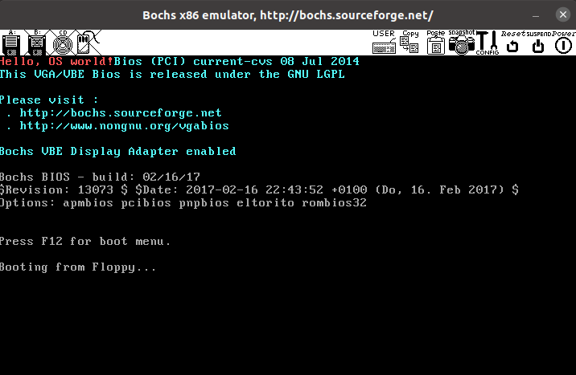

# ch1

## 目录

-   [最小的"操作系统"](#最小的操作系统)
    -   [代码分析   ](#代码分析---)
    -   [运行结果](#运行结果)

### 最小的"操作系统"

```nasm
  org  07c00h      ; 告诉编译器程序加载到7c00处
  mov  ax, cs
  mov  ds, ax
  mov  es, ax
  call  DispStr      ; 调用显示字符串例程
  jmp  $      ; 无限循环
DispStr:
  mov  ax, BootMessage
  mov  bp, ax      ; ES:BP = 串地址
  mov  cx, 16      ; CX = 串长度
  mov  ax, 01301h    ; AH = 13,  AL = 01h
  mov  bx, 000ch    ; 页号为0(BH = 0) 黑底红字(BL = 0Ch,高亮)
  mov  dl, 0
  int  10h      ; 10h 号中断
  ret
BootMessage:    db  "Hello, OS world!"
times   510-($-$$)  db  0  ; 填充剩下的空间，使生成的二进制代码恰好为512字节
dw   0xaa55        ; 结束标志
```

此[代码](https://www.wolai.com/5TaHG3LFHNNyDfZc2p9jpb#d3Q5GsY3UuG5MMM9ozxL92 "代码")为一个简单的引导扇区，启动过程如下：

1.  打开计算机电源
2.  加电自检（POST）
3.  自检完后它会寻找启动盘(在本实验中，根据 bochsrc 的设置，将会从软盘a.img 启动），接下来计算机会检查软盘的0面0磁道1扇区，如果发现是以0xAA55 结束，且包含一段少于 512 字节的执行码，则 BIOS 认为它是一个引导扇区。
4.  BIOS发现引导扇区后，根据 `org 07c00h` 将其装载到07c00h处，然后跳转到此处将控制权交给这段引导代码，此后，计算机不再由BIOS控制。

***

#### 代码分析  &#x20;

***

首先介绍一下nasm中的寄存器，参考[这篇](https://blog.csdn.net/weixin_44691608/article/details/109851814 "这篇")：

> 📌数据寄存器 AX、BX、CX、DX

-   **AX 累加寄存器 (Accumlator)**

    &#x20;通常用于保存算中间值的操作数，也是与 I/O 设备交互时与外设传输数据的寄存器
-   **BX 基址寄存器 (Base)**

    通常用于内存寻址时保存地址基址的寄存器，可以配合 DI、SI 提供更复杂的寻址模式
-   **CX 计数寄存器 (Counter)**

    通常用于保存循环次数(loop 指令会用到)，也可用于保存用于算数运算、位运算的参数等(乘数、位移数等)&#x20;
-   **DX 数据寄存器 (Data)**

    通常就是用于存储数据的，偶尔在大数字的乘除运算时搭配 AX 形成一个操作数
    1.  高位 H 和低位 L：AH、BH、CH、DH、AL、BL、CL、DL
    2.  32位 & 64位：EAX、EBX、ECX、EDX、RAX、RBX、RCX、RDX

> 📌段寄存器：CS、DS、SS、ES、FS、GS

-   **CS 指令段寄存器 (Code)**

    用于保存当前执行程序的指令段(code segment)的起始地址，相当于 section .text 的地址
-   **DS 数据段寄存器 (Data)**

    用于保存当前执行程序的数据段(data segment)的起始地址，相当于 section .data 的地址
-   **SS 栈寄存器 (Stack)**

    用于保存当前栈空间(Stack)的基址，与 SP(偏移量) 相加 -> SS:SP 可找到当前栈顶地址
-   **ES 额外段寄存器 (Extra)**

    常用于字符串操作的内存寻址基址，与变址寄存器 DI 共用
-   **FS、GS 指令段寄存器**

    80386 额外定义的段寄存器，提供程序员更多的段地址选择

> 📌指针寄存器：IP、SP、BP

有了前面的段寄存器保存不同区块(section 或称为段 segment)，我们还有三个寄存器作为块中指针(用来保存偏移量 offset)

-   **IP 指令指针 (Instruction Pointer)**

    与 CS 共用，可透过 CS:IP 寻到当前程序执行到的地址
-   **SP 栈指针 (Stack Pointer)**

    与 SS 共用，可透过 SS:SP 找到当前栈顶地址
-   **BP 参数指针 (Base Pointer)**

    与 SS 共用，可透过 SS:BP 找到当前栈底地址

> 📌变址寄存器：SI、DI

由于寄存器有限，有时候我们并不会直接保存操作数或是操作数的地址，而是保存操作数的某个相对偏移量，透过间接寻址来操作数据。变址寄存器就是在这个过程中负责保存偏移量的部分：

-   **SI 源变址寄存器 (Source Index)**

    通常用于保存源操作数(字符串)的偏移量，与 DS 搭配使用(DS:SI)
-   **DI 目的变址寄存器 (Destination Index)**

    通常用于保存目的操作数(字符串)的偏移量，与 ES 搭配使用(ES:DI)

> 📌控制寄存器 FLAGS 保存 CPU 运行的状态和一些标识位，每个位代表了不同的含义：

-   **(第0位) CF 进位标志位(Carry Flag)：有进位或借位时置 1**
-   **(第2位) PF 奇偶标志位(Parity Flag)：运算结果 1 的个数为偶数时置 1**
-   **(第4位) AF 辅助进位标志位(Assistent Carry Flag)：低四位运算时的进位标志位**
-   **(第6位) ZF 零标志位(Zero Flag)：运算结果为 0 时置 1**
-   **(第7位) SF 符号标志位(Sign Flag)：运算结果为负时置 1，与结果的最高位相同**
-   **(第8位) TF 陷阱标志位(Trap Flag)：置 1 表示单步调试，每次执行一个指令**
-   **(第9位) IF 中断允许标志位(Interrupt Enable Flag)：置 1 时可响应外部中断**
-   **(第10位) DF 方向标志位(Direction Flag)：CLD 指令将 DF 置 1，STD 将 DF 置 0；置 0 时串行指令每次操作 SI、DI 递减(与字符串存储方向相关)**
-   **(第11位) OF 溢出标志位(Overflow Flag)：运算结果溢出时置 1(过大 or 过小)**   &#x20;

***

&#x20;   回到代码NASM 代码块，程序通过mov指令使ds和es两个段寄存器指向cs相同的段之后，把字符串首地址移到bp中，然后这是字符串的颜色等，最后`int 10h`通过调用10号中断显示字符串。

需要重点说明的有一下几点：

1.  在nasm中，任何不被\[]括起来的标签名或变量都为地址，例如`mov  ax, BootMessage`中，BootMessage为字符串的首地址。
2.  关于\$以及\$\$

    \$表示当前行被汇编后的地址，\$\$表示一个节的开始处被汇编后的地址，因此\$-\$\$表示当前行的相对地址。

    则`times   510-($-$$)  db  0`表示把0这个字节重复510-（\$-\$\$）遍，使程序占满510个字节，最后`dw   0xaa55`加上结束标志后正好为512个字节。

***

#### 运行结果

运行结果如下图所示：


