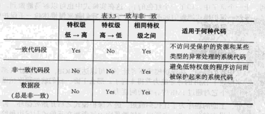
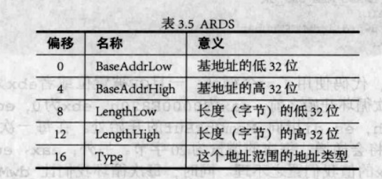

# ch3

## 目录

-   [nasm指令](#nasm指令)
-   [第一部分概述](#第一部分概述)
    -   [运行结果](#运行结果)
-   [保护模式运行环境](#保护模式运行环境)
    -   [配置环境](#配置环境)
-   [GDT 全局描述符表](#GDT-全局描述符表)
    -   [Descriptor描述符宏](#Descriptor描述符宏)
    -   [GDT选择子](#GDT选择子)
    -   [描述符属性](#描述符属性)
    -   [转移规则](#转移规则)
-   [实模式→保护模式](#实模式保护模式)
-   [保护模式进阶](#保护模式进阶)
    -   [.s16](#s16)
    -   [.s32](#s32)
    -   [.s16code](#s16code)
    -   [.s16（LABEL\_REAL\_ENTRY）](#s16LABEL_REAL_ENTRY)
    -   [运行结果](#运行结果)
-   [LDT 局部描述符表](#LDT-局部描述符表)
    -   [运行结果](#运行结果)
-   [特权级概述](#特权级概述)
    -   [CPL 当前特权级](#CPL-当前特权级)
    -   [DPL段/门特权级](#DPL段门特权级)
    -   [RPL 选择子中特权级](#RPL-选择子中特权级)
    -   [不同特权级代码间的转移](#不同特权级代码间的转移)
-   [特权级转移](#特权级转移)
    -   [直接转移](#直接转移)
    -   [门](#门)
    -   [通过调用门进行有特权级转移-理论](#通过调用门进行有特权级转移-理论)
    -   [进入ring3](#进入ring3)
    -   [通过调用门进行有特权级转移-实践](#通过调用门进行有特权级转移-实践)
-   [页式存储](#页式存储)
-   [克勤克俭用内存](#克勤克俭用内存)
    -   [int 15h](#int-15h)
-   [进一步体会分页](#进一步体会分页)
-   [中断和异常](#中断和异常)
    -   [外部中断](#外部中断)
    -   [建立IDT](#建立IDT)
    -   [实现一个中断](#实现一个中断)
    -   [打开时钟中断](#打开时钟中断)
    -   [保护模式下的IO](#保护模式下的IO)

### nasm指令

-   db：伪指令 define byte类似于 char&#x20;
-   equ：类似于#define

### 第一部分概述

该部分将介绍三个section，包括GDT、.s16以及.s32，其中.s16首先修改GDT中的值，然后执行一些指令后跳转到.s32（真正进入保护模式），在32位段中，向某地址写入了两字节（与显存相关）然后无限循环。

#### 运行结果


### 保护模式运行环境

由于引导扇区空间有限，只有512个字节，当程序过大时不能再将其写道引导扇区，应想办法解决，有下面两种方法：

1.  写一个引导扇区，读取我们的程序。
2.  把程序编译成.COM文件，用DOS执行。

我们采用第二种办法。

#### 配置环境

1.  [下载FreeDos](http://bochs.sourceforge.net/guestos/freedos-img.tar.gz "下载FreeDos")，将a.img复制到工作目录中，改名为freedos.img。
2.  用bximage生成一个pm.img的软盘。
3.  修改bochsrc，加入下面三行
    ```matlab
    floppya: 1_44=freedos.img, status=inserted
    floppyb: 1_44=pm.img, status=inserted
    boot: a
    ```
4.  输入`bochs`，启动后输入`format b:` 格式化B盘。
5.  `org 07c00h` 改为`org 0100h` ，重新编译`nasm pmtest1.asm -o pmtest1.com` （.COM文件需放在0100h处）。
6.  将pmtest1.com复制到pm.img上
    ```bash
    sudo mount -o loop pm.img /mnt/floppy
    sudo cp pmtest1.com /mnt/floppy/
    sudo umount /mnt/floppy
    ```
7.  在FreeDos中执行

    `B:\pmtest1.com`

### GDT 全局描述符表

-   物理地址=段值\*16+偏移

    其中，段值和偏移都是16位的，物理地址位20位

    在实模式下，用段 : 偏移表示地址，在保护模式下，段值变成索引，指向GDT（或LDT），GDT作用是提供段式存储机制，**GDT中每一个描述符定义一个段**。

    

首先看\[SECTION .gdt]段：

```nasm
[SECTION .gdt]
; GDT
;                              段基址,       段界限     , 属性
LABEL_GDT:         Descriptor       0,                0, 0           ; 空描述符
LABEL_DESC_CODE32: Descriptor       0, SegCode32Len - 1, DA_C + DA_32; 非一致代码段
LABEL_DESC_VIDEO:  Descriptor 0B8000h,           0ffffh, DA_DRW      ; 显存首地址
; GDT 结束

GdtLen    equ  $ - LABEL_GDT  ; GDT长度
GdtPtr    dw  GdtLen - 1      ; GDT界限
    dd     0                  ; GDT基地址

; GDT 选择子
SelectorCode32    equ  LABEL_DESC_CODE32  - LABEL_GDT
SelectorVideo     equ  LABEL_DESC_VIDEO   - LABEL_GDT
; END of [SECTION .gdt]

```

其中Descriptor为描述符宏。

***

#### Descriptor描述符宏

```nasm
; 描述符
; usage: Descriptor Base, Limit, Attr
;        Base:  dd
;        Limit: dd (low 20 bits available)
;        Attr:  dw (lower 4 bits of higher byte are always 0)
%macro Descriptor 3
  dw  %2 & 0FFFFh        ; 段界限1
  dw  %1 & 0FFFFh        ; 段基址1
  db  (%1 >> 16) & 0FFh      ; 段基址2
  dw  ((%2 >> 8) & 0F00h) | (%3 & 0F0FFh)  ; 属性1 + 段界限2 + 属性2
  db  (%1 >> 24) & 0FFh      ; 段基址3
%endmacro ; 共 8 字节
```

-   nasm中宏定义的格式如下：
    ```nasm
    %macro 宏名 宏入口参数的个数

    宏体

    %endmacro

    ```

&#x20;    在Descriptor中，共输入3个参数，分别表示段基址，段界限，属性。`%1`，`%2`，`%3`分别表示引用第1、2、3个参数。

GDT中共有三个Descriptor，GdtLen和GdtPtr如代码注释所示。

***

#### GDT选择子

SelectorCode32以及SelectorVideo 为选择子


-   当 TI = 0 时,选择子指向 GDT,此时索引是相对于 GDT 的偏移；当 TI= 1 时,选择子指向 LDT,表示相对

    于LDT 的偏移;RPT 是特权级；
-   共有4个特权级（0级、1级、2级、3级）

    关于特权级的说明：任务中的每一个段都有一个特定的级别。每当一个程序试图访问某一个段时，就将该程序所拥有的特权级与要访问的特权级进行比较，以决定能否访问该段。

```nasm
; GDT 选择子
SelectorCode32    equ  LABEL_DESC_CODE32  - LABEL_GDT
SelectorVideo     equ  LABEL_DESC_VIDEO   - LABEL_GDT

```

此时，TI=0，RPL=0。

综上，寻址方式如下图所示:


#### 描述符属性

-   P

    P属性标记了该段是否存在

    P=0表示不存在，P=1表示存在
-   DPL

    特权级，0，1，2，3级，特权级越小，特权越大
-   S

    S=0表示为系统段

    S=1表示为代码段或数据段
-   TYPE

    
-   G

    段界限粒度

    G=0时粒度为字节，G=1时粒度为4KB

    当G = 0并且描述符中的段界限值为10000B，那么该段的界限为10000字节，如果G = 1，那么该段的界限值为40000KB
-   D/B

    
-   AVL

    保留位

通过计算可得

LABEL\_DESC\_CODE32为只执行代码段
LABEL\_DESC\_VIDEO为可读写数据段

***

#### 转移规则

call与jmp的转移规则如下：



***

### 实模式→保护模式

在实模式中，首先对其段描述符进行初始化：

```nasm
xor  eax, eax
mov  ax, cs
shl  eax, 4
add  eax, LABEL_SEG_CODE32
mov  word [LABEL_DESC_CODE32 + 2], ax
shr  eax, 16
mov  byte [LABEL_DESC_CODE32 + 4], al
mov  byte [LABEL_DESC_CODE32 + 7], ah
```

接下来将GDT基地址保存在GdtPtr中的GDT基地址部分（从GdtPtr+2开始）

```nasm
xor  eax, eax
mov  ax, ds
shl  eax, 4
add  eax, LABEL_GDT    ; eax <- gdt 基地址
mov  dword [GdtPtr + 2], eax  ; [GdtPtr + 2] <- gdt 基地址
```

接下来加载gdtr

```nasm
lgdt  [GdtPtr]

```

其将GdtPtr中的6个字节保存到gdtr寄存器，其结构如下图所示：


接下来执行关中断指令

```nasm
cli

```

之后通过操作端口92h打开A20地址线，只有打开A20才能访问到所有内存

```nasm
in  al, 92h   
or  al, 00000010b   
out  92h, al   

```

之后将cr0寄存器的第0位置为1，cr0的第0位是PE位，为0时CPU运行于实模式，为1时CPU运行于保护模式。

```nasm
mov  eax, cr0    
or  eax, 1         ;做与运算,把0位PE置为1   
mov  cr0, eax      
```

最后进入保护模式

```nasm
jmp  dword SelectorCode32:0 ;经过GDT后，实际上跳到.s32处

```

此处防止被截断，需要使用dword

综上，实模式跳转到保护模式的步骤如下：

1.  初始化段描述符
2.  加载gdtr
3.  关中断
4.  打开地址线A20
5.  将cr0的PE置为1
6.  跳转

***

### 保护模式进阶

该部分代码开始部分（即GDT部分）主要增加了堆栈段、数据段、以及Test段（用于测试在保护模式下读写大地址内存）

```nasm
LABEL_DESC_DATA:   Descriptor    0,      DataLen-1, DA_DRW    ; Data
LABEL_DESC_STACK:  Descriptor    0,     TopOfStack, DA_DRWA+DA_32; Stack, 32 位
LABEL_DESC_TEST:   Descriptor 0500000h,     0ffffh, DA_DRW

```

其中Test段的作用是先从5MB处读出8字节的内容，然后写入一个字符串，再从中读出8字节，若不同，则证明读写成功。(Test段的基地址在0500000h处，即5MB)

接下来按照执行顺序进行介绍

***

#### .s16

程序开始后，首先跳到`LABEL_BEGIN`处，即.s16段处。

在.s16段中，先将sp的值（即0100h）赋给`SPValueInRealMode`所指向的地址，此地址位于数据段中，表示实模式下的sp值。

然后将cs（指令段起始地址，即该段的起始地址）的值赋给`LABEL_GO_BACK_TO_REAL+3`所指向的地址，此地址的作用在后面.s16code段中进行介绍。

```nasm
mov  [LABEL_GO_BACK_TO_REAL+3], ax
mov  [SPValueInRealMode], sp
```

之后对16位代码段描述符、32位代码段描述符、数据段描述符、堆栈段描述符进行初始化，例如：

```nasm
; 初始化 16 位代码段描述符
mov  ax, cs
movzx  eax, ax
shl  eax, 4
add  eax, LABEL_SEG_CODE16
mov  word [LABEL_DESC_CODE16 + 2], ax
shr  eax, 16
mov  byte [LABEL_DESC_CODE16 + 4], al
mov  byte [LABEL_DESC_CODE16 + 7], ah

```

接下来与实模式→保护模式一节中介绍的一样，先为加载gdtr做准备，然后加载gdtr，再关中断、打开A20地址线，将cr0的PE置为1，然后跳转到保护模式。

#### .s32

接下来进入保护模式，即32位代码段.s32。

在32位代码段中，首先将各个段寄存器置为相应的段选择子（在16位代码段中不需要这样是因为两种模式寻址方式不同），并将栈顶位置赋给esp（保护模式和实模式的栈顶位置不同）

```nasm
mov  ax, SelectorData
mov  ds, ax      ; 数据段选择子
mov  ax, SelectorTest
mov  es, ax      ; 测试段选择子
mov  ax, SelectorVideo
mov  gs, ax      ; 视频段选择子

mov  ax, SelectorStack
mov  ss, ax      ; 堆栈段选择子

mov  esp, TopOfStack
```

接下来显示一行字符串

```nasm
  mov  ah, 0Ch      ; 0000: 黑底    1100: 红字  
  xor  esi, esi  
  xor  edi, edi  
  mov  esi, OffsetPMMessage  ; 源数据偏移  
  mov  edi, (80 * 10 + 0) * 2  ; 目的数据偏移。即使字符串显示在屏幕第 10 行, 第 0 列。  
  cld  

```

其中 cld指令将标志寄存器Flag的方向标志位DF清零。使字符串由前往后进行处理。

&#x20;`OffsetPMMessage`在数据段中进行定义，如下：

```nasm
PMMessage:    db  "In Protect Mode now. ^-^", 0  ; 在保护模式中显示
OffsetPMMessage    equ  PMMessage - $$
```

其为PMMessage相对于数据段的偏移。

接下来首先显示这个字符串：

```nasm
.1:
  lodsb
  test  al, al
  jz  .2
  mov  [gs:edi], ax
  add  edi, 2
  jmp  .1
```

其中，loadsb是块读出指令，其具体操作是把DS : SI指向的数据读入al寄存器中。当方向标志位DF=0时，则SI自动增加；DF=1时，SI自动减小。

若读完后al为空(即`test al, al`)，说明已经读取完毕，直接跳到.2。若没读取完毕，则将读取到的字符放入对应显存位置。

显示完毕后，进行Test，即测试读写大地址内存。

```nasm
.2:  ; 显示完毕
  call  DispReturn
  call  TestRead
  call  TestWrite
  call  TestRead
  ; 到此停止
  jmp  SelectorCode16:0
```

在这段代码中，首先通过调用`DispReturn`模拟一个回车，即进行换行，接下来通过调用TestRead从5MB处读出8字节的内容：

```nasm
TestRead:
  xor  esi, esi
  mov  ecx, 8
.loop:
  mov  al, [es:esi]
  call  DispAL
  inc  esi
  loop  .loop

  call  DispReturn

  ret
; TestRead 结束-
```

其中，`DispAL`函数的作用是以十六进制的方式显示al中的数据。

之后调用TestWrite在5MB处写8字节的内容，此代码比较简单，与一开始显示的那串字符串类似，只不过是将字符串放入Test段后再通过TestRead读取到显存，而不是将其直接放到视频段：

```nasm
mov  [es:edi], al
```

之后再调用TestRead从5MB处读出写入后的8字节的内容，至此，.s32段结束，重新回到实模式，跳入.s16code段

***

#### .s16code

该段位于跳出保护模式之后，跳入实模式之前，用于将各个段寄存器的值置为实模式下的值，此时我们不能直接将cs的值赋给它们，而是需要用到一个新的描述符，Normal描述符，这是因为实模式下不能更改属性，而从32位代码段返回时cs中的属性不一定满足实模式的要求：

```nasm
LABEL_DESC_NORMAL: Descriptor    0,         0ffffh, DA_DRW    ; Normal 描述符
```

之后再将cr0的PE置为0，然后跳到16位代码段中（`LABEL_REAL_ENTRY`处）：

```nasm
LABEL_SEG_CODE16:
  ; 跳回实模式:
  mov  ax, SelectorNormal
  mov  ds, ax
  mov  es, ax
  mov  fs, ax
  mov  gs, ax
  mov  ss, ax

  mov  eax, cr0
  and  al, 11111110b
  mov  cr0, eax

LABEL_GO_BACK_TO_REAL:
  jmp  0:LABEL_REAL_ENTRY  ; 段地址会在程序开始处被设置成正确的值
```

其中`LABEL_GO_BACK_TO_REAL`中的地址在程序开始时已通过`mov[LABEL_GO_BACK_TO_REAL+3], a`被置为正确的值。

***

#### .s16（LABEL\_REAL\_ENTRY）

回到16位代码段之后，首先对段寄存器以及栈指针寄存器进行赋值：

```nasm
mov  ax, cs
mov  ds, ax
mov  es, ax
mov  ss, ax
mov  sp, [SPValueInRealMode]
```

然后关闭A20地址线，开中断：

```nasm
in  al, 92h    ; `.
and  al, 11111101b  ;  | 关闭 A20 地址线
out  92h, al    ; /

sti      ; 开中断
```

最后再通过调用21h中断回到DOS：

```nasm
mov  ax, 4c00h  ; `.
int  21h    ; /  回到 DOS
```

至此，该部分代码介绍结束。

#### 运行结果


可以看到，此时程序结束后不再进入死循环，而是回到实模式下的DOS。

### LDT 局部描述符表

LDT与GDT类似，但是需要增加两个新的节，即LDT描述符表以及LDT中的一个描述符对应的代码段。 其在GDT中的描述符与选择子定义如下：

```nasm
LABEL_DESC_LDT:    Descriptor       0,        LDTLen - 1, DA_LDT  ; LDT
SelectorLDT    equ  LABEL_DESC_LDT    - LABEL_GDT

```

LDT描述符表以及其对应的代码段在GDT中的描述符同样在开始的16位代码段中进行初始化，过程与其他描述符初始化相似，这里不再进行赘述。

在LDT描述符表中，与GDT一样需要给出其中描述符的定义以及选择子的定义：

```nasm
; LDT
[SECTION .ldt]
ALIGN  32
LABEL_LDT:
;                            段基址       段界限      属性
LABEL_LDT_DESC_CODEA: Descriptor 0, CodeALen - 1, DA_C + DA_32 ; Code, 32 位

LDTLen    equ  $ - LABEL_LDT

; LDT 选择子
SelectorLDTCodeA  equ  LABEL_LDT_DESC_CODEA  - LABEL_LDT + SA_TIL
; END of [SECTION .ldt]

```

需要注意的是，这里TI置为1表示指向的是LDT。

在保护模式下显示完字符串之后，首先加载ldtr，然后再跳入LDT中的局部任务：

```nasm
mov  ax, SelectorLDT
lldt  ax

jmp  SelectorLDTCodeA:0  ; 跳入局部任务

```

此处LDT中的局部任务比较简单，即显示一个字符'L'，这里不再进行赘述。

综上，使用LDT的步骤如下：

1.  在GDT中增加LDT描述符及其选择子。
2.  增加LDT段以及LDT中的代码段(可以多个)，同时在LDT段中增加其中的代码段对应的描述符及选择子。
3.  增加描述符初始化代码。
4.  加载ldtr
5.  跳转

#### 运行结果


### 特权级概述

-   共有4个特权级（0级、1级、2级、3级）

    关于特权级的说明：数字越小表示特权越大，任务中的每一个段都有一个特定的级别，每当一个程序试图访问某一个段时，就将该程序所拥有的特权级与要访问的特权级进行比较，以决定能否访问该段。一般内核在0级，系统服务在1级和2级，应用程序在3级。

#### CPL 当前特权级

-   指当前正在执行程序或任务的特权级,存储在CS的和SS的第0位和第1位上
-   一般情况下，CPL等于当前程序的特权级，程序转移到不同特权级时，处理器将改变CPL
-   特殊情况下，处理器访问一个与CPL特权级不同的一致代码段时,CPL不会改变

#### DPL段/门特权级

表示段或门的特权级,存在描述符的DPL字段中，当当前代码试图访问一个段或门时，DPL将会和CPL以及RPL进行比较，分情况进行讨论：

-   数据段

    DPL规定了可以访问此段的最低特权级，例如若DPL为1那么只有CPL为0或1的能访问它
-   非一致代码段(不使用调用门)

    DPL规定了可以访问此段的特权级，例如若DPL为1那么只有CPL为1的能访问它
-   调用门

    &#x20;与数据段相同
-   TSS（任务状态段）

    与数据段相同
-   一致代码段和通过调用门访问的非一致代码段

    DPL规定了可以访问此段的最高特权级，例如若DPL为1那么只有CPL为0的不能访问它

#### RPL 选择子中特权级

通过段选择子的第0位和第1位表现，RPL和CPL共同决定一个请求的合法性，两者取较大值，即CPL=max(CPL，RPL)。

#### 不同特权级代码间的转移

在转移之前，目标代码段的选择子会加载到cs中，处理器会检查描述符的界限、类型、特权级等内容,如果检查成功，cs 将被加载，程序控制将转移到新的代码段中，从 eip 指示的位置开始执行。

程序控制的转移,可以是由指令jmp、call、ret 、sysenter、sysexit 、int n 、iret 或中断和异常机制引起。

使用jmp或call可以实现四种转移方式，分为两类。

-   直接转移

    目标操作数包含目标代码段的段选择子
-   间接转移
    -   目标操作数指向一个包含目标代码段段选择子的调用门描述符
    -   目标操作数指向一个包含目标代码段段选择子的TSS
    -   目标操作数指向一个任务门，任务门指向一个包含目标代码段段选择子的TSS

### 特权级转移

#### 直接转移

目标是非一致代码段则要求CPL = DPL , RPL <= DPL

目标是一致代码段则要求CPL >= DPL, RPL不检查

**作用非常有限**

#### 门

门也是一种描述符，如下图所示：


其中选择子为目标代码对应段的选择子，选择子与偏移构成了线性地址

有四种门：调用门、中断门、陷阱门、任务门。

先来介绍调用门

-   调用门

    首先增加一个代码段作为调用门的目标代码段，此代码段比较简单，主要功能是显示一个字符'C'，需要注意的是结尾需要加上retf，用来对应call，然后加上此代码段对应的描述符和选择子以及初始化过程。

    加下来添加门描述符，门描述符的宏定义如下：
    ```nasm
    ; 门
    ; usage: Gate Selector, Offset, DCount, Attr
    ;        Selector:  dw
    ;        Offset:    dd
    ;        DCount:    db
    ;        Attr:      db
    %macro Gate 4
      dw  (%2 & 0FFFFh)        ; 偏移1
      dw  %1          ; 选择子
      dw  (%3 & 1Fh) | ((%4 << 8) & 0FF00h)  ; 属性
      dw  ((%2 >> 16) & 0FFFFh)      ; 偏移2
    %endmacro ; 共 8 字节
    ```
    门描述符及其选择子如下：
    ```nasm
    ; 门                               目标选择子,   偏移,DCount, 属性
    LABEL_CALL_GATE_TEST: Gate SelectorCodeDest,   0,     0, DA_386CGate+DA_DPL0

    SelectorCallGateTest  equ  LABEL_CALL_GATE_TEST  - LABEL_GDT

    ```
    接下来跳转到调用门：
    ```nasm
    call  SelectorCallGateTest:0
    ```
    调用门特权级规则如下：

    

    其中，DPL\_B是目标代码段的DPL，DPL\_G是调用门的DPL

    运行结果如下：

    

#### 通过调用门进行有特权级转移-理论

段内跳转为短跳转，段间跳转为长跳转

对jmp来说，长跳转与短跳转相同

对call来说，当为短跳转时，执行下一条指令时，eip压栈，执行ret时，eip弹出

&#x20;                当为长跳转时，es和eip都被压栈，ret时被弹出

在特权级发生变化时，堆栈发生变化，需要将当前堆栈的内容复制到新特权级的堆栈中，这样每个任务最多可能需要4个堆栈，但我们只有一个ss和esp，此时需要使用TSS（任务状态段）：


当发生堆栈切换时，内层的ss和esp就是从这里取得的，由于只有从低特权级到高特权级转移时才会从TSS中获取新堆栈，所以没有ss3和esp3。

综上，转移过程如下：

1.  根据目标代码段的DPL(也就是新的CPL)从TSS中选取ss和esp。
2.  读取ss和esp。
3.  根据新的ss和esp加载新的栈
4.  将旧的ss和esp压栈
5.  从调用者堆栈中将参数复制到新堆栈，参数个数由Param Count(在门描述符中)决定。
6.  将当前的cs和eip压栈
7.  加载新的cs和eip

返回过程（ret/retf）类似于转移过程的反过程，如下：

1.  检查保存的cs中的RPL 以判断返回时是否要变换特权级
2.  加载被调用者堆栈上的cs和eip（此时会进行代码段描述符和选择子类型和特权级检查）
3.  如果ret指令含有参数，则增加esp的值以跳过参数，然后esp将指向被保存过的调用者的ss和esp
4.  加载ss和esp，切换到调用者堆栈，被调用者的ss和esp被丢弃。
5.  如果ret指令含有参数，增加esp的值以跳过参数（此时已经在调用者堆栈中）
6.  检查ds、es、fs、gs的值，如果其中哪一个寄存器指向的段的DPL小于CPL，那么一个空描述符被加载到该寄存器

综上，调用门和call实现从低特权级到高特权级，ret实现从高特权级到低特权级。

#### 进入ring3

首先增加ring3的代码段和堆栈段的描述符：

```nasm
LABEL_DESC_CODE_RING3: Descriptor 0,SegCodeRing3Len-1, DA_C+DA_32+DA_DPL3
LABEL_DESC_STACK3:     Descriptor 0,      TopOfStack3, DA_DRWA+DA_32+DA_DPL3

```

ring3代码段主要功能是输出一个字符'3'，然后无限循环，不会返回DOS。

接下来将ss、esp、cs、eip依次压栈，然后retf

```nasm
push  SelectorStack3
push  TopOfStack3
push  SelectorCodeRing3
push  0
retf
```

运行结果如下：


#### 通过调用门进行有特权级转移-实践

进入ring3，可以使用调用门：

```nasm
; CodeRing3
[SECTION .ring3]
ALIGN  32
[BITS  32]
LABEL_CODE_RING3:
  mov  ax, SelectorVideo
  mov  gs, ax
  mov  edi, (80 * 14 + 0) * 2
  mov  ah, 0Ch
  mov  al, '3'
  mov  [gs:edi], ax

  call  SelectorCallGateTest:0

  jmp  $
SegCodeRing3Len  equ  $ - LABEL_CODE_RING3
; END of [SECTION .ring3]
```

此时还不能运行，需要准备一个TSS：

```nasm
; TSS
[SECTION .tss]
ALIGN  32
[BITS  32]
LABEL_TSS:
    DD  0      ; Back
    DD  TopOfStack    ; 0 级堆栈
    DD  SelectorStack    ; 
    DD  0      ; 1 级堆栈
    DD  0      ; 
    DD  0      ; 2 级堆栈
    DD  0      ; 
    DD  0      ; CR3
    DD  0      ; EIP
    DD  0      ; EFLAGS
    DD  0      ; EAX
    DD  0      ; ECX
    DD  0      ; EDX
    DD  0      ; EBX
    DD  0      ; ESP
    DD  0      ; EBP
    DD  0      ; ESI
    DD  0      ; EDI
    DD  0      ; ES
    DD  0      ; CS
    DD  0      ; SS
    DD  0      ; DS
    DD  0      ; FS
    DD  0      ; GS
    DD  0      ; LDT
    DW  0      ; 调试陷阱标志
    DW  $ - LABEL_TSS + 2  ; I/O位图基址
    DB  0ffh      ; I/O位图结束标志
TSSLen    equ  $ - LABEL_TSS

```

在特权级转换之前需要加载TSS：

```nasm
mov  ax, SelectorTSS
ltr  ax

push  SelectorStack3
push  TopOfStack3
push  SelectorCodeRing3
push  0
retf
```

其中ltr与lgdr和lldt类似。

最后将调用局部任务的代码加入到调用门的目标代码中，最终能返回DOS，结果如下：


### 页式存储

CR0的PG位是分页机制的开关，CR3是页目录表地址寄存器。

逻辑地址、物理地址、线性地址关系如下图（该部分在OS理论课部分已学过）


页目录表项称为PDE，页表项称为PTE。

如下图所示：


首先定义页目录及页表的描述符和选择子：

```nasm
LABEL_DESC_PAGE_DIR: Descriptor PageDirBase, 4095, DA_DRW;Page Directory
LABEL_DESC_PAGE_TBL: Descriptor PageTblBase, 1023, DA_DRW|DA_LIMIT_4K;Page Tables
SelectorPageDir    equ  LABEL_DESC_PAGE_DIR  - LABEL_GDT
SelectorPageTbl    equ  LABEL_DESC_PAGE_TBL  - LABEL_GDT

```

接下来开启页机制，其中stosd把ax中的数据装入es : di指向的存储单元，然后根据DF标志增减di，ecx为循环计数器（假设页表连续且页连续，线性地址等于物理地址）：

```nasm
; 启动分页机制 --------------------------------------------------------------
SetupPaging:
  ; 为简化处理, 所有线性地址对应相等的物理地址.

  ; 首先初始化页目录
  mov  ax, SelectorPageDir  ; 此段首地址为 PageDirBase
  mov  es, ax
  mov  ecx, 1024    ; 共 1K 个表项
  xor  edi, edi
  xor  eax, eax
  mov  eax, PageTblBase | PG_P  | PG_USU | PG_RWW
.1:
  stosd
  add  eax, 4096    ; 为了简化, 所有页表在内存中是连续的.
  loop  .1

  ; 再初始化所有页表 (1K 个, 4M 内存空间)
  mov  ax, SelectorPageTbl  ; 此段首地址为 PageTblBase
  mov  es, ax
  mov  ecx, 1024 * 1024  ; 共 1M 个页表项, 也即有 1M 个页
  xor  edi, edi
  xor  eax, eax
  mov  eax, PG_P  | PG_USU | PG_RWW
.2:
  stosd
  add  eax, 4096    ; 每一页指向 4K 的空间
  loop  .2

  mov  eax, PageDirBase
  mov  cr3, eax
  mov  eax, cr0
  or  eax, 80000000h
  mov  cr0, eax
  jmp  short .3
.3:
  nop

  ret
; 分页机制启动完毕 -------------
```

首先循环1024遍，初始化页目录，再循环1024\*1024遍，初始化页表，最后将页目录位置存在cr3中，并将cr0的PG位置为1。

### 克勤克俭用内存

#### int 15h

-   输入
    1.  eax

        0E820h 获取内存信息
    2.  ebx

        存放后续值，，第一次调用时必须为0
    3.  es ：di

        指向地址范围描述符结构ARDS
    4.  ecx

        ARDS的大小，以字节为单位
    5.  edx

        0534D4150h（'SMAP'）校验系统映像信息
-   输出
    1.  CF

        为0表示没有错误，为1表示有错误
    2.  eax

        0534D4150h（'SMAP'）
    3.  es ：di

        和输入值相同
    4.  ecx

        BIOS实际填充在ARDS的字节数量
    5.  ebx

        通过它获取下一个地址描述符

ARDS如下：



其中Type如下：


在调用int 15h之前，需要开辟一段缓冲区（本例中大小为256字节），用于存放输出信息：

```nasm
_MemChkBuf:  times  256  db  0
```

接下来在实模式下将所有内存信息(即所有ARDS，每个20字节)读入缓冲区：

```nasm
  mov  ebx, 0
  mov  di, _MemChkBuf
.loop:
  mov  eax, 0E820h
  mov  ecx, 20
  mov  edx, 0534D4150h
  int  15h
  jc  LABEL_MEM_CHK_FAIL
  add  di, 20
  inc  dword [_dwMCRNumber]
  cmp  ebx, 0
  jne  .loop
  jmp  LABEL_MEM_CHK_OK
LABEL_MEM_CHK_FAIL:
  mov  dword [_dwMCRNumber], 0
LABEL_MEM_CHK_OK:

```

其中`_dwMCRNumber`为ARDS的个数，也为循环的次数。

需要注意的是，每个类似于`_dwMCRNumber`的值都有两部分，分别用于实模式和保护模式：

```nasm
_dwMCRNumber:      dd  0  ; Memory Check Result
dwMCRNumber    equ  _dwMCRNumber  - $$ ;用于保护模式

```

之后跳转到保护模式，将缓冲区中的内容输出即可。

结果如下图所示：


得到内存信息后，可以对页表进行优化，只初始化MemSize/4M个页表即可。

### 进一步体会分页

接下来使用两个页表进一步体会分页机制，通过改变cr3中的页目录表基址来进行页表的切换。

两个页表如下：

```nasm
PageDirBase0    equ  200000h  ; 页目录开始地址:  2M
PageTblBase0    equ  201000h  ; 页表开始地址:    2M +  4K
PageDirBase1    equ  210000h  ; 页目录开始地址:  2M + 64K
PageTblBase1    equ  211000h  ; 页表开始地址:    2M + 64K + 4K
```

在PagingDemo中调用ProcPagingDemo，ProcPagingDemo再调用LinearAddrDemo，开始LinearAddrDemo被映射为ProcFoo，切换页表后被映射为ProcBar，这两个函数分别输出Foo和Bar。如图所示：


执行结果如下所示：


### 中断和异常

保护模式下,实模式能用的BIOS中断向量表已经被新的IDT代替了，IDT是中断描述符表，与LDT，GDT类似，可能有中断门描述符、陷阱门描述符、任务门描述符三种类型描述符，不对任务门进行分析。

IDT如下所示：


通过int调用中断门和陷阱门，与call类似，中断门和陷阱门描述符如下：


TYPE为0xE（中断门）或0xF（陷阱门）

中断异常表如下：


分为三种类型

1.  Fault

    可更正，返回产生fault的指令
2.  Trap

    可更正，返回后面一条指令
3.  Abort

    不可更正

中断有两种，一种是由硬件产生的外部中断，一种是由int n 产生的中断

#### 外部中断

分为不可屏蔽中断和可屏蔽中断，分别由CPU的NMI和INTR引脚来接收

NMI中断向量号为2，前面以及介绍。

可屏蔽中断是通过可编程中断控制器8259A建立(分为主和从)：


引起中断或异常的设备都是直接与中断控制器8259A相连的，这样可以设置是否屏蔽，当发生异常或中断，8259A就会做出决定让哪个异常先得到请求。

对8259A的设置是通过向相应端口写入特定的ICW实现的，主8259A对应20h和21h端口，从8259A对应A0h和A1h端口。ICW有四个字节。按ICW1-4的顺序写入端口。

ICW格式如下：


写入ICW之后，可写入OCW1-3，只在屏蔽或打开外部中断：


发送EOI给8259A通知中断结束时使用：


#### 建立IDT

IDT描述符如下：

```nasm
; IDT
[SECTION .idt]
ALIGN  32
[BITS  32]
LABEL_IDT:
; 门            目标选择子,            偏移, DCount, 属性
%rep 255
    Gate  SelectorCode32, SpuriousHandler, 0, DA_386IGate
%endrep

IdtLen    equ  $ - LABEL_IDT
IdtPtr    dw  IdtLen - 1  ; 段界限
    dd  0    ; 基地址
; END of [SECTION .idt]
```

全部255个描述符相同，SpuriousHandler为打印红色的'!'，然后死循环。

同时，idtr也需要加载，但其需要在关中断后加载：

```nasm
; 为加载 IDTR 作准备
  xor  eax, eax
  mov  ax, ds
  shl  eax, 4
  add  eax, LABEL_IDT    ; eax <- idt 基地址
  mov  dword [IdtPtr + 2], eax  ; [IdtPtr + 2] <- idt 基地址
  ; 关中断
  cli

  ; 加载 IDTR
  lidt  [IdtPtr]
```

#### 实现一个中断

修改IDT，使80h号中断指向新的相应函数：

`.080h:		Gate	SelectorCode32, UserIntHandler,  0, DA_386IGate`

在UserIntHandler中，不再进入死循环，而是通过iretd指令返回。

中断或异常发生时，堆栈变化如下：


返回必须使用iretd，与ret很相似，但会改变eflags的值。需要注意的是，通过中断门和陷阱门的中断相当于用call指令调用一个调用门，涉及特权级变换的规则一样。

中断门和陷阱门的区别在于由中断门引起的中断会复位IF，避免其他中断的干扰，iretd指令会恢复IF的原值。而通过陷阱门产生的中断不会改变IF。

运行结果：


#### 打开时钟中断

当IF为1且IMR（8259A的中断屏蔽寄存器）相应位为0可屏蔽中断才能发生。

因此需要设置IMR且通过sti指令设置IF。设置IMR可通过写OCW2完成。

修改IDT如下:

```nasm
; IDT
[SECTION .idt]
ALIGN  32
[BITS  32]
LABEL_IDT:
; 门                        目标选择子,            偏移, DCount, 属性
%rep 32
    Gate  SelectorCode32, SpuriousHandler,      0, DA_386IGate
%endrep
.020h:    Gate  SelectorCode32,    ClockHandler,      0, DA_386IGate
%rep 95
    Gate  SelectorCode32, SpuriousHandler,      0, DA_386IGate
%endrep
.080h:    Gate  SelectorCode32,  UserIntHandler,      0, DA_386IGate

IdtLen    equ  $ - LABEL_IDT
IdtPtr    dw  IdtLen - 1  ; 段界限
    dd  0    ; 基地址
; END of [SECTION .idt]
```

其中时钟中断处理函数是使字符加1。

运行结果：

[2.mp4](video/2_Rxxde5bxXx.mp4)

#### 保护模式下的IO

-   IOPL

    I/O保护机制的关键之一，位于eflags的12、13位：

    

    I/O敏感指令in、ins、out、outs、cli、sti只有在CPL≤IOPL时才能执行。

    可以改变IOPL的指令只有运行在ring0下的popf和iretd
-   I/O许可位图

    位于TSS中，每一位表示一个字节的端口地址是否可用，为1可用，为0不可用，每一个任务可以有单独的I/O许可位图。
