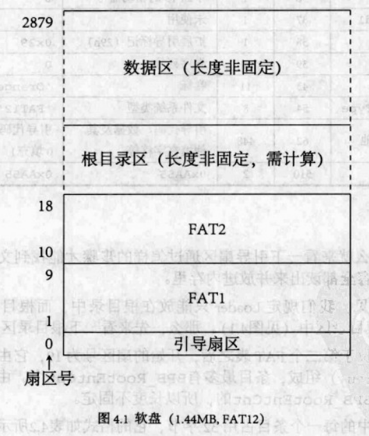
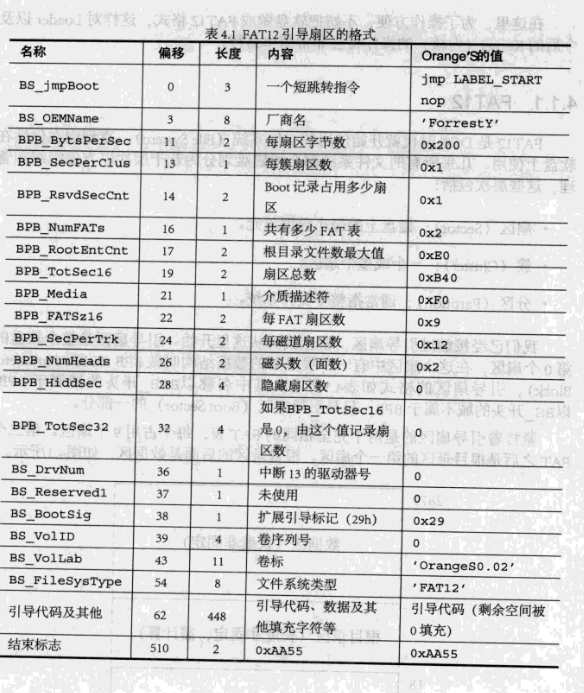
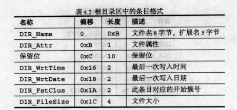
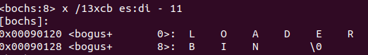
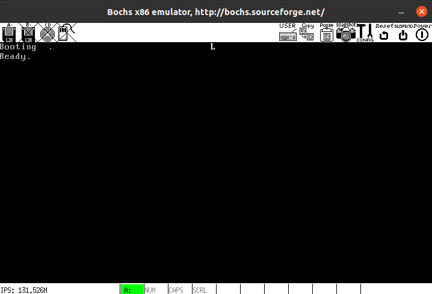
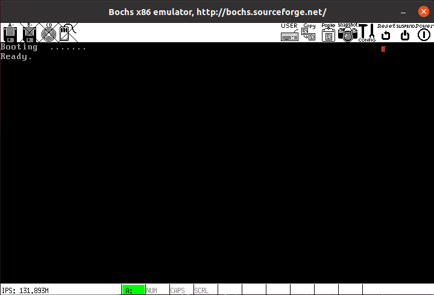

# ch4

## 目录

-   [突破512字节的限制](#突破512字节的限制)
    -   [FAT12文件系统](#FAT12文件系统)
    -   [DOS可以识别的引导盘](#DOS可以识别的引导盘)
    -   [制作Loader](#制作Loader)
    -   [加载Loader](#加载Loader)
    -   [控制权交给Loader](#控制权交给Loader)
    -   [整理](#整理)
-   [总结](#总结)

### 突破512字节的限制

磁盘空间很大，所以可以把操作系统写在单独的文件，放在磁盘中，通过一段程序在磁盘中找到系统文件，再把系统加载进内存中，然后再执行。

操作系统从开机到运行，经历 **“引导→加载内核→跳入保护模式→开始执行内核”** 的过程。也就是说在内核开始执行之前不但要加载内核还有准备保护模式等一系列工作，全交给引导扇区512字节可能不够用，因此交给Loader，引导扇区把Loader载入内存并且把控制权交给他。

为了更方便操作Loader以及以后的Kernel，把软盘做成FAT12格式。

#### FAT12文件系统

层次

-   扇区：磁盘上的最小数据单元
-   簇：一个或多个扇区
-   分区：通常指整个文件系统

引导扇区

位于整个软盘的第0扇区，有个重要数据叫BPB（BIOS Parameter Block）。如下图所示(需要注意的是，数据区的第一个簇簇号是2，FAT2可以看作是FAT1的备份)：



引导扇区中名称以BPB\_开头的域属于BPB，以BS\_开头的域不属于BPB，只是引导扇区的一部分。如下图所示：



规定Loader只能放在根目录中，由若干目录条目组成，条目最多有BPB\_RootEntCnt个，长度不固定，一个条目占用32个字节，每个条目格式如下：



FAT表

每12位为1个FAT项，从第2项开始，即第2个FAT项表示第一个簇，FAT项的值代表文件下一个簇号，如果大于等于0xFF8则是最后一个簇，如果为0xFF7，表示是一个坏簇。

#### DOS可以识别的引导盘

引导扇区需要有BPB等头信息才能被微软识别，写入Boot.asm中后生成Boot.bin写入引导扇区，此时能被DOS识别了。

#### 制作Loader

首先写一个最简单的loader，显示字符'L'并进入无限循环。

之后需要将Loader加载进内存，需要使用int 13h中断，其需要磁头号、柱面号和扇区号三个参数，对1.44MB的软盘来说，有两面（0和1），每面80个磁道（磁道号0-79），每个磁道有18个扇区（1-18）。

Loader先写入Boot的软盘中（根分区），然后再通过其中的引导扇区被加载进入内存。

在Boot中写入头信息后首先初始化堆栈：

```nasm
BaseOfStack    equ  07c00h  ; 堆栈基地址(栈底, 从这个位置向低地址生长)
mov  ax, cs
mov  ds, ax
mov  es, ax
mov  ss, ax
mov  sp, BaseOfStack

```

接下来在Boot中写一个读软盘扇区的函数：

```nasm
ReadSector:
  ; -----------------------------------------------------------------------
  ; 怎样由扇区号求扇区在磁盘中的位置 (扇区号 -> 柱面号, 起始扇区, 磁头号)
  ; -----------------------------------------------------------------------
  ; 设扇区号为 x
  ;                           ┌ 柱面号 = y >> 1
  ;       x           ┌ 商 y ┤
  ; -------------- => ┤      └ 磁头号 = y & 1
  ;  每磁道扇区数     │
  ;                   └ 余 z => 起始扇区号 = z + 1
  push  bp
  mov  bp, sp
  sub  esp, 2 ; 辟出两个字节的堆栈区域保存要读的扇区数: byte [bp-2]

  mov  byte [bp-2], cl
  push  bx      ; 保存 bx
  mov  bl, [BPB_SecPerTrk]  ; bl: 除数
  div  bl      ; y 在 al 中, z 在 ah 中
  inc  ah      ; z ++
  mov  cl, ah      ; cl <- 起始扇区号
  mov  dh, al      ; dh <- y
  shr  al, 1      ; y >> 1 (y/BPB_NumHeads)
  mov  ch, al      ; ch <- 柱面号
  and  dh, 1      ; dh & 1 = 磁头号
  pop  bx      ; 恢复 bx
  ; 至此, "柱面号, 起始扇区, 磁头号" 全部得到
  mov  dl, [BS_DrvNum]    ; 驱动器号 (0 表示 A 盘)
.GoOnReading:
  mov  ah, 2      ; 读
  mov  al, byte [bp-2]    ; 读 al 个扇区
  int  13h
  jc  .GoOnReading    ; 如果读取错误 CF 会被置为 1, 
          ; 这时就不停地读, 直到正确为止
  add  esp, 2
  pop  bp

  ret
```

其作用是将cl个扇区读入es : bx中。

接下来需要在软盘中寻找Loader.bin，首先进行软驱复位：

```nasm
xor  ah, ah ; `.
xor  dl, dl  ;  |  软驱复位
int  13h    ;  /
```

接下来在 A 盘的根目录寻找 LOADER.BIN：

依次将根目录中扇区读出到BaseOfLoader：OffseOfLoader中，然后将改扇区的所有文件名与"LOADER  BIN"进行比较，寻找loader文件。

根目录最多有224个文件描述符，每个32字节，每个扇区512字节：

32\*224/512=14

即根目录共占用14个扇区，最外层循环为14次。

每个扇区512个字节，根目录中每个条目32个字节，因此一个扇区中有16个条目，即第二层循环为16次：

```nasm
  mov  word [wSectorNo], SectorNoOfRootDirectory
LABEL_SEARCH_IN_ROOT_DIR_BEGIN:
  cmp  word [wRootDirSizeForLoop], 0  ;  `. 判断根目录区是不是已经读完
  jz  LABEL_NO_LOADERBIN    ;  /  如果读完表示没有找到 LOADER.BIN
  dec  word [wRootDirSizeForLoop]  ; /
  mov  ax, BaseOfLoader
  mov  es, ax      ; es <- BaseOfLoader
  mov  bx, OffsetOfLoader  ; bx <- OffsetOfLoader
  mov  ax, [wSectorNo]    ; ax <- Root Directory 中的某 Sector 号
  mov  cl, 1
  call  ReadSector

  mov  si, LoaderFileName  ; ds:si -> "LOADER  BIN"
  mov  di, OffsetOfLoader  ; es:di -> BaseOfLoader:0100
  cld
  mov  dx, 10h                 ;512/32=16 
```

其中 SectorNoOfRootDirectory为根分区的开始扇区，为19号扇区。

后面的代码比较简单，不再进行赘述。

由于本代码中找到loader后便进入死循环，因此需要进行调试：

```nasm
LABEL_FILENAME_FOUND:      ; 找到 LOADER.BIN 后便来到这里继续
  jmp  $      ; 代码暂时停在这里

```

首先再0x7c00处打断点：

`  b 0x7c00
 `

运行到断点后跳过BPB：

`n`

之后进行反汇编

`u /45` [^注释1]

之后在无限循环处设断点：

`b 0x7cad`

显示es : di -11处的字符：

`x /13xcb es:di - 11`

结果如下：



#### 加载Loader

找到loader之后，需要将loader的所有扇区均装入内存：

首先加入了两个新的宏：

```nasm
SectorNoOfFAT1    equ  1  ; FAT1 的第一个扇区号 = BPB_RsvdSecCnt
DeltaSectorNo    equ  17  ; DeltaSectorNo = BPB_RsvdSecCnt + (BPB_NumFATs * FATSz) - 2
   ; 文件的开始Sector号 = DirEntry中的开始Sector号 + 根目录占用Sector数目 + DeltaSectorNo
   ;32
```

写入一个新的函数GetFATEntry，输入为扇区号(ax)，输出为其对应的FAT项的值（也存在ax中）。

首先在内存的栈中为FAT预留位置：

```nasm
mov  ax, BaseOfLoader; `.
sub  ax, 0100h  ;  | 在 BaseOfLoader 后面留出 4K 空间用于存放 FAT
mov  es, ax    ; /
```

接下来由于FAT项为12个字节，因此需要区别对待扇区号为奇数偶数的情况：

```nasm
  pop  ax
  mov  byte [bOdd], 0
  mov  bx, 3
  mul  bx      ; dx:ax = ax * 3
  mov  bx, 2
  div  bx      ; dx:ax / 2  ==>  ax <- 商, dx <- 余数
  cmp  dx, 0
  jz  LABEL_EVEN
  mov  byte [bOdd], 1
LABEL_EVEN:;偶数
  ; 现在 ax 中是 FATEntry 在 FAT 中的偏移量,下面来
  ; 计算 FATEntry 在哪个扇区中(FAT占用不止一个扇区)
  xor  dx, dx      
  mov  bx, [BPB_BytsPerSec]
  div  bx ; dx:ax / BPB_BytsPerSec
       ;  ax <- 商 (FATEntry 所在的扇区相对于 FAT 的扇区号)
       ;  dx <- 余数 (FATEntry 在扇区内的偏移)。
  push  dx
  mov  bx, 0 ; bx <- 0 于是, es:bx = (BaseOfLoader - 100):00
  add  ax, SectorNoOfFAT1 ; 此句之后的 ax 就是 FATEntry 所在的扇区号
  mov  cl, 2
  call  ReadSector ; 读取 FATEntry 所在的扇区, 一次读两个, 避免在边界
         ; 发生错误, 因为一个 FATEntry 可能跨越两个扇区
  pop  dx
  add  bx, dx
  mov  ax, [es:bx]
  cmp  byte [bOdd], 1
  jnz  LABEL_EVEN_2
  shr  ax, 4
LABEL_EVEN_2:
  and  ax, 0FFFh

LABEL_GET_FAT_ENRY_OK:

  pop  bx
  pop  es
  ret
```

接下来首先在根分区中的Loader文件描述符(32字节)中找到起始相对扇区号(也为在FAT中的序号)：

```nasm
mov  ax, RootDirSectors
and  di, 0FFE0h    ; di -> 当前条目的开始 32Bytes per Entry
add  di, 01Ah    ; di -> 首 Sector
mov  cx, word [es:di]
push  cx      ; 保存此 Sector 在 FAT 中的序号

```

接下来计算出起始扇区号对应的在软盘中的绝对扇区号：

```nasm
add  cx, ax
add  cx, DeltaSectorNo  ; cl <- LOADER.BIN的起始扇区号(0-based)
```

接下来将此扇区读入内存：

```nasm
mov  cl, 1
call  ReadSector
```

然后得出其对应FAT表项中的值，之后再循环下去即可：

```nasm
pop  ax      ; 取出此 Sector 在 FAT 中的序号
call  GetFATEntry
cmp  ax, 0FFFh
jz  LABEL_FILE_LOADED
push  ax      ; 保存 Sector 在 FAT 中的序号
```

#### 控制权交给Loader

将Loader加载进入内存后，需要将控制权交给Loader：

```nasm
jmp  BaseOfLoader:OffsetOfLoader  ; 这一句正式跳转到已加载到内
            ; 存中的 LOADER.BIN 的开始处，
            ; 开始执行 LOADER.BIN 的代码。
            ; Boot Sector 的使命到此结束。
```

#### 整理

首先清屏然后显示Booting：

```nasm
; 清屏
  mov  ax, 0600h    ; AH = 6,  AL = 0h
  mov  bx, 0700h    ; 黑底白字(BL = 07h)
  mov  cx, 0      ; 左上角: (0, 0)
  mov  dx, 0184fh    ; 右下角: (80, 50)
  int  10h      ; int 10h

  mov  dh, 0      ; "Booting  "
```

Loader加载完毕后显示Ready：

```nasm
LABEL_FILE_LOADED:

  mov  dh, 1      ; "Ready."
  call  DispStr      ; 显示字符串

```

运行结果如下：



用第三章的代码替换Loader，运行结果如下：



### 总结

Loader要做的事至少两件：

1.  加载内核进入内存
2.  跳入保护模式

[^注释1]: 汇编45条指令
