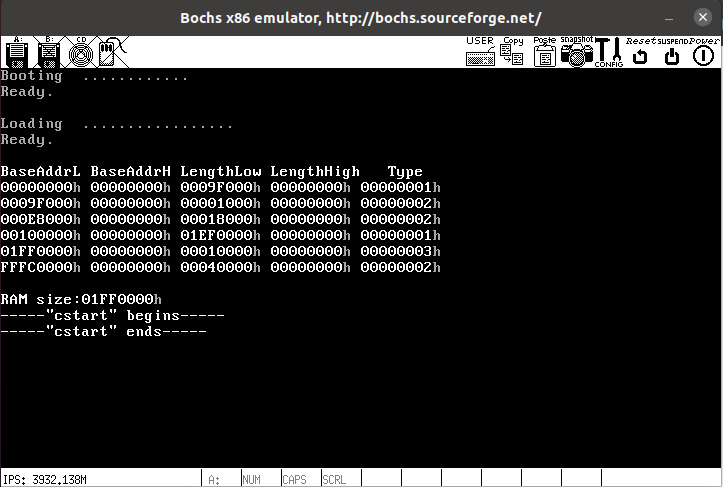

# ch5

## 目录

-   [Hello World](#Hello-World)
-   [混用汇编和C](#混用汇编和C)
-   [ELF](#ELF)
    -   [ELF header](#ELF-header)
    -   [Program header](#Program-header)
-   [从Loader到内核](#从Loader到内核)
    -   [用Loader加载ELF](#用Loader加载ELF)
    -   [重新放置内核](#重新放置内核)
    -   [向内核交出控制权](#向内核交出控制权)
-   [扩充内核](#扩充内核)
    -   [切换堆栈和GDT](#切换堆栈和GDT)
    -   [整理文件夹](#整理文件夹)
    -   [Makefile](#Makefile)
    -   [添加中断处理](#添加中断处理)

### Hello World

输入下面的命令：

```matlab
nasm -f elf hello.asm -o hello.o
ld -m elf_i386 -s hello.o -o hello
./hello
```

结果如下：


### 混用汇编和C

过程如下图所示：


\_start为入口，需要用global修饰以便被链接器识别，choose需要用extern修饰，myprint再bar.c中被调用，需要用global修饰：

```nasm
extern choose  ; int choose(int a, int b);
global _start  ; 我们必须导出 _start 这个入口，以便让链接器识别。
global myprint  ; 导出这个函数为了让 bar.c 使用

```

**编写汇编语言过程中，后面的参数先入栈，由调用者清理堆栈。**

输入下面的命令：

```matlab
nasm -f elf foo.asm -o foo.o
gcc -m32 -c bar.c -o bar.o
ld -m elf_i386 -s -o foobar foo.o bar.o
./foobar
```

结果如下：


### ELF

[参考](https://www.w3cschool.cn/article/c692b4047e2a70.html "参考")

`ELF`是一类文件类型，而不是特指某一后缀的文件，主要有以下三种文件类型：

-   **可执行文件（.out）**：`Executable File`，包含代码和数据，是可以直接运行的程序。其代码和数据都有固定的地址 （或相对于基地址的偏移 ），系统可根据这些地址信息把程序加载到内存执行。
-   **可重定位文件（.o文件）**：`Relocatable File`，包含基础代码和数据，但它的代码及数据都没有指定绝对地址，因此它适合于与其他目标文件链接来创建可执行文件或者共享目标文件。
-   **共享目标文件（.so）**：`Shared Object File`，也称动态库文件，包含了代码和数据，这些数据是在链接时被链接器（`ld`）和运行时动态链接器（`ld.so.l、libc.so.l、ld-linux.so.l`）使用的。

由四部分组成：

-   ELF头 ELF header
-   程序头表 Program header table
-   节 Sections
-   节头表 Section header table

如下图所示：


#### ELF header

其代码如下所示：

```c++
typedef struct {
        unsigned char   e_ident[EI_NIDENT]; //EI_NIDENT=16
        Elf64_Half      e_type;
        Elf64_Half      e_machine;
        Elf64_Word      e_version;
        Elf64_Addr      e_entry;
        Elf64_Off       e_phoff;
        Elf64_Off       e_shoff;
        Elf64_Word      e_flags;
        Elf64_Half      e_ehsize;
        Elf64_Half      e_phentsize;
        Elf64_Half      e_phnum;
        Elf64_Half      e_shentsize;
        Elf64_Half      e_shnum;
        Elf64_Half      e_shstrndx;
} Elf64_Ehdr;
```

其中e\_ident前四个字节为.ELF，还包含文件和操作系统信息，如文件编码方式，ABI等级等等，不重要。

其他成员的数据类型介绍如下：


-   e\_type

    文件类型

    &#x20;foobar为2，表示为可执行文件
-   e\_machine

    foobar中为3，表示体系结构为Intel 80386
-   e\_version

    确定文件的版本
-   e\_entry

    程序的入口地址，foobar为0x80480A0
-   e\_phoff

    Program header table 的偏移量（字节为单位），foobar为0x34
-   e\_shoff

    Section header table 的偏移量（字节为单位），foobar为0x1C0
-   e\_ehsize

    ELF header的大小，foobar为0x34
-   e\_flags

    对IA32而言，此项为0
-   e\_phentsize

    Program header table中每个条目的大小，foobar为0x20
-   e\_phnum

    Program header table 中有多少条目，foobar为3
-   e\_shentsize

    Section header table中每个条目的大小，foobar为0x28
-   e\_shnum

    Section header table有多少条目，foobar为6
-   e\_shstrndx

    包含节名称的字符串表是第几个节(从0开始)，foobar中为5

#### Program header

描述一个段在文件中的位置、大小以及它被放进内存后的位置和大小。

如下所示：

```c++
typedef struct
{
  Elf32_Word  p_type;      /* Segment type */
  Elf32_Off   p_offset;    /* Segment file offset  段的第一个字节在文件中的偏移，以下均为第一个字节*/
  Elf32_Addr  p_vaddr;    /* Segment virtual address */
  Elf32_Addr  p_paddr;    /* Segment physical address */
  Elf32_Word  p_filesz;    /* Segment size in file */
  Elf32_Word  p_memsz;    /* Segment size in memory */
  Elf32_Word  p_flags;    /* Segment flags */
  Elf32_Word  p_align;    /* Segment alignment */
} Elf32_Phdr;

```

foobar中有3个段：


加载进内存后如下所示：


### 从Loader到内核

#### 用Loader加载ELF

首先找到kernel.bin然后将其读入内存，这与Boot加载loader类似，不再进行赘述。

其中用到了一个新的函数用于关闭软驱马达（不重要）：

```nasm
; 函数名: KillMotor
;----------------------------------------------------------------------------
; 作用:
;  关闭软驱马达
KillMotor:
  push  dx
  mov  dx, 03F2h
  mov  al, 0
  out  dx, al
  pop  dx
  ret
;----------------------------------------------------------------------------

```

运行结果如下图所示：


接下来首先在Loader中写入GDT：

```nasm
; GDT
;                            段基址     段界限, 属性
LABEL_GDT:      Descriptor 0,            0, 0              ; 空描述符
LABEL_DESC_FLAT_C:  Descriptor 0,      0fffffh, DA_CR|DA_32|DA_LIMIT_4K ;0-4G
LABEL_DESC_FLAT_RW: Descriptor 0,      0fffffh, DA_DRW|DA_32|DA_LIMIT_4K;0-4G
LABEL_DESC_VIDEO:   Descriptor 0B8000h, 0ffffh, DA_DRW|DA_DPL3 ; 显存首地址

GdtLen    equ  $ - LABEL_GDT
GdtPtr    dw  GdtLen - 1        ; 段界限
    dd  BaseOfLoaderPhyAddr + LABEL_GDT    ; 基地址

; GDT 选择子
SelectorFlatC    equ  LABEL_DESC_FLAT_C  - LABEL_GDT
SelectorFlatRW    equ  LABEL_DESC_FLAT_RW  - LABEL_GDT
SelectorVideo    equ  LABEL_DESC_VIDEO  - LABEL_GDT + SA_RPL3

```

其中用到的一些宏如下：

```nasm
BaseOfLoader      equ   09000h  ; LOADER.BIN 被加载到的位置 ----  段地址
OffsetOfLoader      equ    0100h  ; LOADER.BIN 被加载到的位置 ---- 偏移地址

BaseOfLoaderPhyAddr equ  BaseOfLoader*10h ; LOADER.BIN 被加载到的位置 ---- 物理地址

BaseOfKernelFile    equ   08000h  ; KERNEL.BIN 被加载到的位置 ----  段地址
OffsetOfKernelFile  equ       0h  ; KERNEL.BIN 被加载到的位置 ---- 偏移地址
```

与ch3中不同的点在于此时段地址已被确认为BaseOfLoader，不用在运行时计算。

接下来进入保护模式，与ch3中相同，进入后打印一个字符"P"，运行结果如下：


成功进入保护模式，接下来进入下面的工作：

再加入分页机制并显示内存，运行结果如下所示：


#### 重新放置内核

接下来根据Program header table的信息进行类似于下面C语言的内存复制：

```c++
memcpy(p_vaddr，BaseOfLoaderPhyAddr+p_offset，p_filesz)
```

Program header有n个就复制n次。

其中p\_offset为段在文件中的偏移，p\_filesz为文件长度，p\_vaddr为段在内存中的虚拟地址。

之前生成的p\_vaddr类似于0x8048xxx，处在128MB内存以外，因此要让p\_vaddr变小，可通过改变ld指令：

```matlab
ld -m elf_i386 -s -Ttext 0x30400 -o kernel.bin kernel.o
```

这样程序入口地址就变成0x30400了，ELF header等信息位于此位置之前。


根据上面两个表格，应该这样放置内核：

```c++
memcpy(30000h,90000h+0,40Dh);
```

程序入口在0x30400处，即代码有0Dh+1个字节。

接下来遍历每一个 Program Header，根据 Program Header 中的信息来确定把什么放进内存，放到什么位置，以及放多少。

```c++
; InitKernel ---------------------------------------------------------------------------------
; 将 KERNEL.BIN 的内容经过整理对齐后放到新的位置
; 遍历每一个 Program Header，根据 Program Header 中的信息来确定把什么放进内存，放到什么位置，以及放多少。
; --------------------------------------------------------------------------------------------
InitKernel:
        xor   esi, esi
        mov   cx, word [BaseOfKernelFilePhyAddr+2Ch];`. ecx <- pELFHdr->e_phnum
        movzx ecx, cx                               ;/
        mov   esi, [BaseOfKernelFilePhyAddr + 1Ch]  ; esi <- pELFHdr->e_phoff
        add   esi, BaseOfKernelFilePhyAddr;esi<-OffsetOfKernel+pELFHdr->e_phoff
.Begin:
        mov   eax, [esi + 0]
        cmp   eax, 0                      ; PT_NULL
        jz    .NoAction
        push  dword [esi + 010h]    ;size ;`.
        mov   eax, [esi + 04h]            ; |
        add   eax, BaseOfKernelFilePhyAddr; | memcpy((void*)(pPHdr->p_vaddr),
        push  eax        ;src  ; |      uchCode + pPHdr->p_offset,
        push  dword [esi + 08h]     ;dst  ; |      pPHdr->p_filesz;
        call  MemCpy                      ; |
        add   esp, 12                     ;/
.NoAction:
        add   esi, 020h                   ; esi += pELFHdr->e_phentsize
        dec   ecx
        jnz   .Begin

        ret
; InitKernel ^^^^^^^^^^^^^^^^^^^^^^^^^^^^^^^^^^^^^^^^^^^^^^^^^^^^^^^^^^^^^^^^^^^^^^^^^^^^^^^^^

```

位置：

0x90000开始的63KB留给了Loader.bin，0x80000开始的64KB留给了Kernel.bin，0x30000开始的320KB留给了整理后的内核

#### 向内核交出控制权

跳转入内核：

```nasm
jmp  SelectorFlatC:KernelEntryPointPhyAddr  ; 正式进入内核 
```

运行结果如下图所示：


可以看见，在内核中打印了一个字符'K'。

### 扩充内核

#### 切换堆栈和GDT

目前，esp和GDT还在Loader中，需要把他们转入内核。

```nasm
; 导入函数
extern  cstart

; 导入全局变量
extern  gdt_ptr

[SECTION .bss]
StackSpace    resb  2 * 1024
StackTop:    ; 栈顶

[section .text]  ; 代码在此

global _start  ; 导出 _start

_start:
  ; 此时内存看上去是这样的（更详细的内存情况在 LOADER.ASM 中有说明）：
  ;              ┃                                    ┃
  ;              ┃                 ...                ┃
  ;              ┣━━━━━━━━━━━━━━━━━━┫
  ;              ┃■■■■■■Page  Tables■■■■■■┃
  ;              ┃■■■■■(大小由LOADER决定)■■■■┃ PageTblBase
  ;    00101000h ┣━━━━━━━━━━━━━━━━━━┫
  ;              ┃■■■■Page Directory Table■■■■┃ PageDirBase = 1M
  ;    00100000h ┣━━━━━━━━━━━━━━━━━━┫
  ;              ┃□□□□ Hardware  Reserved □□□□┃ B8000h ← gs
  ;       9FC00h ┣━━━━━━━━━━━━━━━━━━┫
  ;              ┃■■■■■■■LOADER.BIN■■■■■■┃ somewhere in LOADER ← esp
  ;       90000h ┣━━━━━━━━━━━━━━━━━━┫
  ;              ┃■■■■■■■KERNEL.BIN■■■■■■┃
  ;       80000h ┣━━━━━━━━━━━━━━━━━━┫
  ;              ┃■■■■■■■■KERNEL■■■■■■■┃ 30400h ← KERNEL 入口 (KernelEntryPointPhyAddr)
  ;       30000h ┣━━━━━━━━━━━━━━━━━━┫
  ;              ┋                 ...                ┋
  ;              ┋                                    ┋
  ;           0h ┗━━━━━━━━━━━━━━━━━━┛ ← cs, ds, es, fs, ss
  ;
  ;
  ; GDT 以及相应的描述符是这样的：
  ;
  ;                  Descriptors               Selectors
  ;              ┏━━━━━━━━━━━━━━━━━━┓
  ;              ┃         Dummy Descriptor           ┃
  ;              ┣━━━━━━━━━━━━━━━━━━┫
  ;              ┃         DESC_FLAT_C    (0～4G)     ┃   8h = cs
  ;              ┣━━━━━━━━━━━━━━━━━━┫
  ;              ┃         DESC_FLAT_RW   (0～4G)     ┃  10h = ds, es, fs, ss
  ;              ┣━━━━━━━━━━━━━━━━━━┫
  ;              ┃         DESC_VIDEO                 ┃  1Bh = gs
  ;              ┗━━━━━━━━━━━━━━━━━━┛
  ;
  ; 注意! 在使用 C 代码的时候一定要保证 ds, es, ss 这几个段寄存器的值是一样的
  ; 因为编译器有可能编译出使用它们的代码, 而编译器默认它们是一样的. 比如串拷贝操作会用到 ds 和 es.
  ;
  ;


  ; 把 esp 从 LOADER 挪到 KERNEL
  mov  esp, StackTop  ; 堆栈在 bss 段中

  sgdt  [gdt_ptr]  ; cstart() 中将会用到 gdt_ptr
  call  cstart    ; 在此函数中改变了gdt_ptr，让它指向新的GDT
  lgdt  [gdt_ptr]  ; 使用新的GDT

  ;lidt  [idt_ptr]

  jmp  SELECTOR_KERNEL_CS:csinit
csinit:    ; “这个跳转指令强制使用刚刚初始化的结构”——<<OS:D&I 2nd>> P90.

  push  0
  popfd  ; Pop top of stack into EFLAGS

  hlt;使CPU睡眠
```

其中sgdt的作用是将gdtr中的地址复制到gdt\_ptr中。

cstart是用c写的，其首先把位于Loader中的原GDT全部复制给新的GDT，然后把gdt\_ptr中的内容换成新的GDT的基地址和界限。

编译时，需要注意命令要改为：

```matlab
gcc -m32 -c -fno-builtin -o start.o start.ic
```

这是因为memcpy会被编译器默认为内建函数。

编译运行如下所示：(此文件夹中kliba.asm提供了disp\_str函数)。


#### 整理文件夹

目录树如下所示：


#### Makefile

```makefile
ASM             = nasm
ASMFLAGS        = -I include/

```

\-I表示编译时不仅搜素当前目录下的文件，还会搜索include/下的文件。

```makefile
TARGET          = boot.bin loader.bin

```

两个目标文件

```makefile
.PHONY : everything clean all

```

三个行为，.PHONY表示后面的不是文件，是行为。

```makefile
everything : $(TARGET)

clean :
        rm -f $(TARGET)

all : clean everything

```

everything表示按照指令生成所有目标文件(在后面讲解)，clean表示删除所有目标文件，all表示先clean在everything。

```makefile
boot.bin : boot.asm include/load.inc include/fat12hdr.inc
        $(ASM) $(ASMFLAGS) -o $@ $<

loader.bin : loader.asm include/load.inc include/fat12hdr.inc include/pm.inc
        $(ASM) $(ASMFLAGS) -o $@ $<

```

```makefile
此为最重要的语法，
Target : prerequisites
         Command
#Target 依赖 prerequisites，当 prerequisites 中至少有一个文件比 target文件新时，command 才被执行。
#$@ 代表 target
#$<代表 prerequisites 的第一个名字。
```

将boot文件夹中的makefile移到主目录中时，命令变为：

```matlab
make all -f Makefile.boot
```

需要注意的是，这一章中的kliba.asm有问题，可能会输出乱码，解决方法见[参考链接](https://blog.csdn.net/qq_35353673/article/details/119010254 "参考链接")。

make image后运行结果如下图所示：



#### 添加中断处理

有两项工作，设置8259A和建立IDT

设置8259A与前面的类似，只不过用C代码完成。想要打开或屏蔽某中断，写入OCW1即可，若要屏蔽某中断，把OCW1对应位置为1。

建立IDT与建立GDT类似，不再进行赘述。

下面需要使IDT充实起来。

总体思想是：如果有错误码，则直接把向量号压栈，如果没有，则把
0xFFFFFFFF 压栈，表示没有错误码，然后再把向量号压栈。然后直接执行异常处理的控制函数 exception\_handler。

该代码中exception\_handler为输出错误类型，EFLAGS，CS和EIP。


函数总结：

init\_prot()函数首先调用init\_8259A()函数对8259A进行初始化，然后对所有中断通过调用init\_idt\_desc()函数初始化中断门，其中参数handler指向每种中断的处理函数，每个中断的处理函数执行过程是：如果有错误码，则直接把向量号压栈，如果没有，则把0xFFFFFFFF 压栈后再把向量号压栈，然后执行exception\_handler。

8259A有15个不同的外部设备，理应还有15个中断处理程序，与上面的函数总结过程类似。

只不过exception\_handler变为了spurious\_irq，其作用是显示irq号。

之后通过写入OCW1打开外部中断：

```c++
/* Master 8259, OCW1.  */
  out_byte(INT_M_CTLMASK,  0xFD);

/* Slave  8259, OCW1.  */
out_byte(INT_S_CTLMASK,  0xFF);
```

之后再添加sti指令开中断即可。

编译运行后，敲击键盘结果如下图所示：


