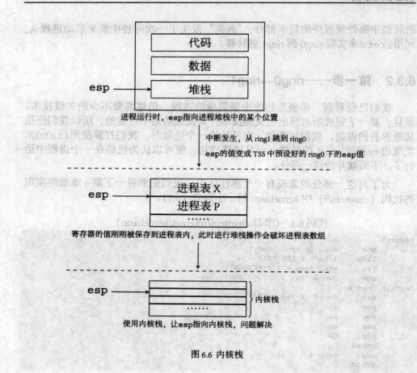

# ch6

## 目录

-   [进程概述](#进程概述)
-   [最简单的进程](#最简单的进程)
    -   [调度过程](#调度过程)
    -   [需要完成的工作](#需要完成的工作)
    -   [关键技术](#关键技术)
    -   [第一步 ring0→ring1](#第一步-ring0ring1)
    -   [第二步 丰富中断处理程序](#第二步-丰富中断处理程序)
-   [多进程](#多进程)
    -   [添加一个进程体](#添加一个进程体)
    -   [初始化](#初始化)
    -   [修改中断处理程序](#修改中断处理程序)
    -   [学习Minix进行代码整理](#学习Minix进行代码整理)
-   [系统调用](#系统调用)
    -   [简单系统调用](#简单系统调用)
    -   [get\_ticks的应用](#get_ticks的应用)
-   [进程调度](#进程调度)

### 进程概述

-   PCB
-   进程运行在ring1，进程切换运行在ring1

### 最简单的进程

#### 调度过程

1.  进程A运行
2.  时钟中断发生，ring1→ring0，中断处理程序启动
3.  进程调度，进程B被指定
4.  进程B被恢复，ring0→ring1
5.  进程B运行

如下图所示：


#### 需要完成的工作

1.  时钟中断处理程序
2.  进程调度模块
3.  两个进程

#### 关键技术

-   保存所有寄存器的值，用push/pushad保存
-   用pop以及iretd回到进程B
-   进程表(PCB)数组
-   分清进程栈和内核栈：

    
-   ring1→ring0

    从TSS中取出内层的ss和esp，为每个进程准备LDT
-   ring0→ring1

    时钟中断处理程序，利用iretd返回ring1

#### 第一步 ring0→ring1

操作系统启动第一个进程的入口为restart()函数：

```nasm
restart:
  mov  esp, [p_proc_ready]
  lldt  [esp + P_LDT_SEL]
  lea  eax, [esp + P_STACKTOP]
  mov  dword [tss + TSS3_S_SP0], eax
restart_reenter:
  dec  dword [k_reenter]
  pop  gs
  pop  fs
  pop  es
  pop  ds
  popad
  add  esp, 4
  iretd
```

其中p\_proc\_ready为一个指向进程表(PCB)的指针。存放的是下一个要启动进程的进程表的地址。进程表如下所示：


这样才会使pop和popad指令执行后寄存器更新一遍。

代码中，p\_proc\_ready是一个结构类型指针(struct s\_proc \*)，其中s\_proc这个结构体的第一个成员也是结构体，为s\_stackframe，s\_proc为进程表，s\_stackframe存放寄存器的值，要恢复一个进程时，将esp指向此结构体开始处，然后运行一系列pop将寄存器值弹出。如下所示：


接下来加载ldt(在restart()之前做了ldt\_sel初始化工作)，接下来将s\_proc中第一个结构体成员regs的末地址赋给TSS中的ring0堆栈指针域(esp)，下一次中断发生时，esp将变成regs的末地址，然后ss，esp，eflags，cs，eip等依次被压栈。

-   时钟中断处理程序

    只实现ring0→ring1的转移，用一个iretd指令即可。
    ```nasm
    ALIGN  16
    hwint00:    ; Interrupt routine for irq 0 (the clock).
      iretd
    ```
-   进程表 进程体 GDT TSS

一个进程开始之前，需要指定好各段寄存器、eip、esp、eflags即可运行。

其中段寄存器有cs、ds、es、fs、gs、ss

需要注意的是，这里的段寄存器对应的将是LDT而不再是GDT中的描述符。LDT也放在进程表中，GDT中需要有LDT和和TSS的描述符。

进程表内的LDT选择子指向的内存空间存在于进程表内。

关系如下图所示：


1.  首先准备小进程体：
    ```c++
    void TestA()
    {
      int i = 0;
      while(1){
        disp_str("A");
        disp_int(i++);
        disp_str(".");
        delay(1);
      }
    }
    ```
    在kernel中，最后跳入kernel\_main()函数，此函数完成初始化工作，并调用restart()函数。
2.  初始化进程表

    进程表如下：
    ```c++
    typedef struct s_proc {
      STACK_FRAME regs;          /* process registers saved in stack frame */

      u16 ldt_sel;               /* gdt selector giving ldt base and limit */
      DESCRIPTOR ldts[LDT_SIZE]; /* local descriptors for code and data */
      u32 pid;                   /* process id passed in from MM */
      char p_name[16];           /* name of the process */
    }PROCESS;
    ```
    进程表数组如下：
    ```c++
    PUBLIC  PROCESS      proc_table[NR_TASKS];
    ```
    目前试验一个进程，NR\_TASKS=1.

    在kernel\_main中初始化进程表：
    ```c++
    PUBLIC int kernel_main()
    {
      disp_str("-----\"kernel_main\" begins-----\n");

      PROCESS* p_proc  = proc_table;

      p_proc->ldt_sel  = SELECTOR_LDT_FIRST;
      memcpy(&p_proc->ldts[0], &gdt[SELECTOR_KERNEL_CS>>3], sizeof(DESCRIPTOR));
      p_proc->ldts[0].attr1 = DA_C | PRIVILEGE_TASK << 5;  // change the DPL
      memcpy(&p_proc->ldts[1], &gdt[SELECTOR_KERNEL_DS>>3], sizeof(DESCRIPTOR));
      p_proc->ldts[1].attr1 = DA_DRW | PRIVILEGE_TASK << 5;  // change the DPL

      p_proc->regs.cs  = (0 & SA_RPL_MASK & SA_TI_MASK) | SA_TIL | RPL_TASK;
      p_proc->regs.ds  = (8 & SA_RPL_MASK & SA_TI_MASK) | SA_TIL | RPL_TASK;
      p_proc->regs.es  = (8 & SA_RPL_MASK & SA_TI_MASK) | SA_TIL | RPL_TASK;
      p_proc->regs.fs  = (8 & SA_RPL_MASK & SA_TI_MASK) | SA_TIL | RPL_TASK;
      p_proc->regs.ss  = (8 & SA_RPL_MASK & SA_TI_MASK) | SA_TIL | RPL_TASK;
      p_proc->regs.gs  = (SELECTOR_KERNEL_GS & SA_RPL_MASK) | RPL_TASK;
      p_proc->regs.eip= (u32)TestA;
      p_proc->regs.esp= (u32) task_stack + STACK_SIZE_TOTAL;
      p_proc->regs.eflags = 0x1202;  // IF=1, IOPL=1, bit 2 is always 1.

      p_proc_ready  = proc_table;
      restart();

      while(1){}
    }
    ```
    初始化LDT中的两个描述符，为简化起见，分别被初始化为内核代码段和内核数据段，改变DPL让其运行在低特权级下。

    接下来令cs指向第一个描述符，其他指向第二个描述符，gs指向显存。

    eip指向TestA，esp指向了单独的栈，最后一行设置eflags，其设置了IF位并把IOPL设为1，这样进程就可以使用I/O指令，且中断会在iretd执行时被打开。

    之后需要在GDT中加入LDT描述符
3.  准备GDT和TSS

    GDT中的LDT和TSS都通过init\_prot()中的init\_descriptor初始化。

    TSS准备好后，需要加载tr，在kernel.asm中加载即可。
4.  此时各寄存器的值已经准备好，只需要让esp指向栈顶即可，调用iretd。

运行结果如下图所示：(不要忘记修改kliba.asm，[见链接](https://blog.csdn.net/qq_35353673/article/details/119010254 "见链接"))


综上，第一个进程启动过程示意图如下：


#### 第二步 丰富中断处理程序

此时还没有打开时钟中断，需要在init\_8259A()中通过输入OCW1打开时钟中断。之后还要写入EOI，使时钟中断可以不停发生。

EOI通知8259A芯片一个中断完成，8259A将负责把ISR中的位清除，以便以后可以继续接受中断。如果不加的话，8259a永远收不到中断结束命令，那么就认为某一个中断一直在执行，所以如果遇到比这个阻塞的中断级别低或者相等的中断发生时就不会再响应了。

ISR是中断服务寄存器。它用于保存正在服务的中断源。在中断响应时，判优电路把发出中断请求的中断源中优先级最高的中断源所对应的位设置为1，表示该中断源正在处理中。ISR某一位置1课阻止与它同级和更低优先级的请求被响应，但允许更高优先级的请求被响应。

```c++
ALIGN  16
hwint00:    ; Interrupt routine for irq 0 (the clock).
  mov  al, EOI    ; `. reenable
  out  INT_M_CTL, al  ; / master 8259
  iretd

```

结果如下：(不要忘记改kliba)


但这样看不出来时钟中断，我们将时钟中断修改，其不断改变一个字符。

```c++
ALIGN  16
hwint00:    ; Interrupt routine for irq 0 (the clock).
  inc  byte [gs:0]  ; 改变屏幕第 0 行, 第 0 列的字符
  mov  al, EOI    ; `. reenable
  out  INT_M_CTL, al  ; / master 8259
  iretd

```

运行结果如下图所示：


左上角的P一直在变动。

在中断过程中，还需要保存现场：

```c++
ALIGN  16
hwint00:    ; Interrupt routine for irq 0 (the clock).
  pushad    ; `.
  push  ds  ;  |
  push  es  ;  | 保存原寄存器值
  push  fs  ;  |
  push  gs  ; /

  inc  byte [gs:0]  ; 改变屏幕第 0 行, 第 0 列的字符

  mov  al, EOI    ; `. reenable
  out  INT_M_CTL, al  ; /  master 8259

  pop  gs  ; `.
  pop  fs  ;  |
  pop  es  ;  | 恢复原寄存器值
  pop  ds  ;  |
  popad    ; /

  iretd

ALIGN  16
```

只需保存这12个寄存器(显式保存了4个，pushad保存了个)，其他进程表(PCB)需要保存的寄存器值在发生中断时保存，同时iretd需要这些之前保存的寄存器，不能pop。

结果如下图所示：(与上面的一样)


接下来需要对tss.esp0进行赋值，由于不停中断，因此在ring0和ring1之间不断切换，一方面代码在切换，另一方面堆栈也在切换。

堆栈切换在iretd时完成，目标代码的cs，eip，ss，esp等从堆栈中获得。但从ring1到ring0需要用到TSS，TSS中的ss0在初始化时已经被赋值，但esp0还未赋值，需要在中断处理程序中(即在ring0→ring1之前)赋值，最终，我们的时钟中断处理程序如下：(可以看出，这段代码的后半段是restart()函数)。

```c++
ALIGN  16
hwint00:    ; Interrupt routine for irq 0 (the clock).
  sub  esp,4
  pushad    ; `.
  push  ds  ;  |
  push  es  ;  | 保存原寄存器值
  push  fs  ;  |
  push  gs  ; /
  mov  dx, ss
  mov  ds, dx
  mov  es, dx

  inc  byte [gs:0]  ; 改变屏幕第 0 行, 第 0 列的字符

  mov  al, EOI    ; `. reenable
  out  INT_M_CTL, al  ; /  master 8259

  lea  eax, [esp + P_STACKTOP]
  mov  dword [tss + TSS3_S_SP0], eax

  pop  gs  ; `.
  pop  fs  ;  |
  pop  es  ;  | 恢复原寄存器值
  pop  ds  ;  |
  popad    ; /
  add  esp,4

  iretd

```

由于此时只有一个进程，因此esp0的赋值是重复的，但有多个进程时，tss.esp0可能被赋值为进程B或C的值。

运行结果如下图所示：(与前面的一样)


接下来当中断处理程序比较复杂时需要用到内核栈，将代码修改如下：

```c++

ALIGN  16
hwint00:    ; Interrupt routine for irq 0 (the clock).
  sub  esp, 4
  pushad    ; `.
  push  ds  ;  |
  push  es  ;  | 保存原寄存器值
  push  fs  ;  |
  push  gs  ; /
  mov  dx, ss
  mov  ds, dx
  mov  es, dx
  
  mov  esp, StackTop    ; 切到内核栈

  inc  byte [gs:0]    ; 改变屏幕第 0 行, 第 0 列的字符

  mov  al, EOI      ; `. reenable
  out  INT_M_CTL, al    ; /  master 8259
  
  push  clock_int_msg
  call  disp_str
  add  esp, 4
  
  mov  esp, [p_proc_ready]  ; 离开内核栈

  lea  eax, [esp + P_STACKTOP]
  mov  dword [tss + TSS3_S_SP0], eax

  pop  gs  ; `.
  pop  fs  ;  |
  pop  es  ;  | 恢复原寄存器值
  pop  ds  ;  |
  popad    ; /
  add  esp, 4

  iretd
```

最终运行结果如下图所示(其中INT\_M\_CTL为'^'字符)：


中断重入：

应该允许中断嵌套。

kernel\_main()函数中加入一个全局变量k\_reenter，初值为-1，在中断处理程序中开始自加，结束时自减，若不为0，则说明已经发生了中断嵌套，直接结束中断即可。最终时钟中断处理程序如下所示：

```c++
ALIGN  16
hwint00:    ; Interrupt routine for irq 0 (the clock).
  sub  esp, 4
  pushad    ; `.
  push  ds  ;  |
  push  es  ;  | 保存原寄存器值
  push  fs  ;  |
  push  gs  ; /
  mov  dx, ss
  mov  ds, dx
  mov  es, dx

  inc  byte [gs:0]    ; 改变屏幕第 0 行, 第 0 列的字符

  mov  al, EOI      ; `. reenable
  out  INT_M_CTL, al    ; /  master 8259

  inc  dword [k_reenter]
  cmp  dword [k_reenter], 0
  jne  .re_enter
  
  mov  esp, StackTop    ; 切到内核栈

  sti;set interruption
  
  push  clock_int_msg
  call  disp_str
  add  esp, 4

;;;   push  1
;;;   call  delay
;;;   add  esp, 4
  
  cli
  
  mov  esp, [p_proc_ready]  ; 离开内核栈

  lea  eax, [esp + P_STACKTOP]
  mov  dword [tss + TSS3_S_SP0], eax

.re_enter:  ; 如果(k_reenter != 0)，会跳转到这里
  dec  dword [k_reenter]
  pop  gs  ; `.
  pop  fs  ;  |
  pop  es  ;  | 恢复原寄存器值
  pop  ds  ;  |
  popad    ; /
  add  esp, 4

  iretd

```

运行结果如下图所示：


综上，中断处理过程如下：

1.  设置打开中断(本例中为时钟中断)
2.  用push保护好现场，如寄存器的值等（在中断处理程序中）。
3.  切换到内核栈
4.  开中断，使中断可以嵌套
5.  执行中断处理程序
6.  关中断
7.  设置ring0状态下的堆栈esp0，为下一次进程中断使用

### 多进程

#### 添加一个进程体

此进程与第一个进程类似，只不过输出字符变为'B'

#### 初始化

与第一个进程一样，第二个进程也需要初始化PCB等，为了方便起见，新建了几个数据类型。

```c
PUBLIC  TASK  task_table[NR_TASKS] = {{TestA, STACK_SIZE_TESTA, "TestA"},
                                      {TestB, STACK_SIZE_TESTB, "TestB"}};
```

其中TestA和TestB为函数句柄，被双引号括起来的为自己取的进程名称，STACK\_SIZE\_TESTA和STACK\_SIZE\_TESTB为栈的大小。

然后通过for循环在kernel\_main中对PCB进行初始化：

```c
PUBLIC int kernel_main()
{
  disp_str("-----\"kernel_main\" begins-----\n");

  TASK*    p_task    = task_table;
  PROCESS*  p_proc    = proc_table;
  char*    p_task_stack  = task_stack + STACK_SIZE_TOTAL;
  u16    selector_ldt  = SELECTOR_LDT_FIRST;
  int i;
  for(i=0;i<NR_TASKS;i++){
    strcpy(p_proc->p_name, p_task->name);  // name of the process
    p_proc->pid = i;      // pid

    p_proc->ldt_sel = selector_ldt;

    memcpy(&p_proc->ldts[0], &gdt[SELECTOR_KERNEL_CS >> 3],
           sizeof(DESCRIPTOR));
    p_proc->ldts[0].attr1 = DA_C | PRIVILEGE_TASK << 5;
    memcpy(&p_proc->ldts[1], &gdt[SELECTOR_KERNEL_DS >> 3],
           sizeof(DESCRIPTOR));
    p_proc->ldts[1].attr1 = DA_DRW | PRIVILEGE_TASK << 5;
    p_proc->regs.cs  = ((8 * 0) & SA_RPL_MASK & SA_TI_MASK)
      | SA_TIL | RPL_TASK;
    p_proc->regs.ds  = ((8 * 1) & SA_RPL_MASK & SA_TI_MASK)
      | SA_TIL | RPL_TASK;
    p_proc->regs.es  = ((8 * 1) & SA_RPL_MASK & SA_TI_MASK)
      | SA_TIL | RPL_TASK;
    p_proc->regs.fs  = ((8 * 1) & SA_RPL_MASK & SA_TI_MASK)
      | SA_TIL | RPL_TASK;
    p_proc->regs.ss  = ((8 * 1) & SA_RPL_MASK & SA_TI_MASK)
      | SA_TIL | RPL_TASK;
    p_proc->regs.gs  = (SELECTOR_KERNEL_GS & SA_RPL_MASK)
      | RPL_TASK;

    p_proc->regs.eip = (u32)p_task->initial_eip;
    p_proc->regs.esp = (u32)p_task_stack;
    p_proc->regs.eflags = 0x1202; /* IF=1, IOPL=1 */

    p_task_stack -= p_task->stacksize;
    p_proc++;
    p_task++;
    selector_ldt += 1 << 3;
  }

  k_reenter = -1;

  p_proc_ready  = proc_table; 
  restart();

  while(1){}
}

```

LDT同样需要通过for循环进行初始化：

```c
// 填充 GDT 中进程的 LDT 的描述符
  int i;
  PROCESS* p_proc  = proc_table;
  u16 selector_ldt = INDEX_LDT_FIRST << 3;
  for(i=0;i<NR_TASKS;i++){
    init_descriptor(&gdt[selector_ldt>>3],
        vir2phys(seg2phys(SELECTOR_KERNEL_DS),
          proc_table[i].ldts),
        LDT_SIZE * sizeof(DESCRIPTOR) - 1,
        DA_LDT);
    p_proc++;
    selector_ldt += 1 << 3;
  }
}
```

每个进程都有自己的ldt，进程切换时需要重新加载ldtr。

#### 修改中断处理程序

一个进程从睡眠变成运行只需将esp指向进程表开始处，在指向lldt后经历一系列pop即可：

```c
ALIGN  16
hwint00:    ; Interrupt routine for irq 0 (the clock).
  sub  esp, 4
  pushad    ; `.
  push  ds  ;  |
  push  es  ;  | 保存原寄存器值
  push  fs  ;  |
  push  gs  ; /
  mov  dx, ss
  mov  ds, dx
  mov  es, dx

  inc  byte [gs:0]    ; 改变屏幕第 0 行, 第 0 列的字符

  mov  al, EOI      ; `. reenable
  out  INT_M_CTL, al    ; /  master 8259

  inc  dword [k_reenter]
  cmp  dword [k_reenter], 0
  jne  .re_enter
  
  mov  esp, StackTop    ; 切到内核栈

  sti
  push  0
  call  clock_handler
  add  esp, 4
  cli
  
  mov  esp, [p_proc_ready]  ; 离开内核栈
  lldt  [esp + P_LDT_SEL]
  lea  eax, [esp + P_STACKTOP]
  mov  dword [tss + TSS3_S_SP0], eax

.re_enter:  ; 如果(k_reenter != 0)，会跳转到这里
  dec  dword [k_reenter]
  pop  gs  ; `.
  pop  fs  ;  |
  pop  es  ;  | 恢复原寄存器值
  pop  ds  ;  |
  popad    ; /
  add  esp, 4
  iretd
```

结果如下图所示：


此时还未进行进程切换，但做好了所有准备。

修改clock\_handler如下：

```c
PUBLIC void clock_handler(int irq)
{
  disp_str("#");
  p_proc_ready++;
  if (p_proc_ready >= proc_table + NR_TASKS)
    p_proc_ready = proc_table;
}
```

结果如下图所示：


综上，添加一个进程的过程如下：

1.  添加一个进程
2.  task\_table中添加一项进程
3.  进程数(NR\_TASKS)加1
4.  定义任务堆栈
5.  修改堆栈总大小
6.  添加函数声明

#### 学习Minix进行代码整理

-   修改时钟中断处理程序

修改后如下所示：

```nasm
ALIGN  16
hwint00:    ; Interrupt routine for irq 0 (the clock).
  sub  esp, 4
  pushad    ; `.
  push  ds  ;  |
  push  es  ;  | 保存原寄存器值
  push  fs  ;  |
  push  gs  ; /
  mov  dx, ss
  mov  ds, dx
  mov  es, dx

  inc  byte [gs:0]    ; 改变屏幕第 0 行, 第 0 列的字符

  mov  al, EOI      ; `. reenable
  out  INT_M_CTL, al    ; /  master 8259

  inc  dword [k_reenter]
  cmp  dword [k_reenter], 0
  jne  .1  ; 重入时跳到.1，通常情况下顺序执行
  ;jne  .re_enter
  
  mov  esp, StackTop    ; 切到内核栈

  push  .restart_v2
  jmp  .2
.1:          ; 中断重入
  push  .restart_reenter_v2
.2:          ; 没有中断重入
  sti
  
  push  0          
  call  clock_handler
  add  esp, 4
  
  cli

  ret  ; 重入时跳到.restart_reenter_v2，通常情况下到.restart_v2

.restart_v2:
  mov  esp, [p_proc_ready]  ; 离开内核栈
  lldt  [esp + P_LDT_SEL]
  lea  eax, [esp + P_STACKTOP]
  mov  dword [tss + TSS3_S_SP0], eax

.restart_reenter_v2:      ; 如果(k_reenter != 0)，会跳转到这里
;.re_enter:  ; 如果(k_reenter != 0)，会跳转到这里
  dec  dword [k_reenter]
  pop  gs  ; `.
  pop  fs  ;  |
  pop  es  ;  | 恢复原寄存器值
  pop  ds  ;  |
  popad    ; /
  add  esp, 4

  iretd
```

其于我们之前写的基本类似，只不过写得更加优雅，当发生中断重入时，不用切换到内核栈以及退出内核栈，只有在第一个中断需要切换以及退出内核栈。同时修改clock\_handler，发生中断重入时，输出'!'然后直接返回，其他时候正常。

此时可以进一步修改，注意到此代码后半段与一开始介绍的从ring0→ring1几乎一致，直接用那一段即可：

```nasm

ALIGN  16
hwint00:    ; Interrupt routine for irq 0 (the clock).
  sub  esp, 4
  pushad    ; `.
  push  ds  ;  |
  push  es  ;  | 保存原寄存器值
  push  fs  ;  |
  push  gs  ; /
  mov  dx, ss
  mov  ds, dx
  mov  es, dx

  inc  byte [gs:0]    ; 改变屏幕第 0 行, 第 0 列的字符

  mov  al, EOI      ; `. reenable
  out  INT_M_CTL, al    ; /  master 8259

  inc  dword [k_reenter]
  cmp  dword [k_reenter], 0
  jne  .1  ; 重入时跳到.1，通常情况下顺序执行
  
  mov  esp, StackTop    ; 切到内核栈

  push  restart
  jmp  .2
.1:          ; 中断重入
  push  restart_reenter
.2:          ; 没有中断重入
  sti
  
  push  0          
  call  clock_handler
  add  esp, 4
  
  cli

  ret
```

将保存寄存器都部分移到save中：

```nasm
ALIGN  16
hwint00:    ; Interrupt routine for irq 0 (the clock).
  call  save

  mov  al, EOI      ; `. reenable
  out  INT_M_CTL, al    ; /  master 8259

  sti
  push  0          
  call  clock_handler
  add  esp, 4
  cli

  ret
```

之后再加入两段代码，在发生时钟中断的时候不会发生其他时钟中断：

```nasm
ALIGN  16
hwint00:    ; Interrupt routine for irq 0 (the clock).
  call  save

  in  al, INT_M_CTLMASK  ; `.
  or  al, 1      ;  | 不允许再发生时钟中断
  out  INT_M_CTLMASK, al  ; /

  mov  al, EOI      ; `. reenable
  out  INT_M_CTL, al    ; /  master 8259

  sti
  push  0          
  call  clock_handler
  add  esp, 4
  cli

  in  al, INT_M_CTLMASK  ; `.
  and  al, 0xFE    ;  | 又允许时钟中断发生
  out  INT_M_CTLMASK, al  ; /

  ret

ALIGN  16
```

接下来将其修改为宏即可，在宏中，中断处理程序被保存在一个新的结构体irq\_table中。

在kernel\_main()中针对时钟中断进行设置：

```c
 put_irq_handler(CLOCK_IRQ, clock_handler); /* 设定时钟中断处理程序 */
 enable_irq(CLOCK_IRQ);                     /* 让8259A可以接收时钟中断 */
```

最终结果如下图所示(与前面的相同)：


### 系统调用

目前，我们的OS结构如下图所示：


#### 简单系统调用

实现一个获得中断次数的系统调用：

```nasm
%include "sconst.inc"

_NR_get_ticks       equ 0 ; 要跟 global.c 中 sys_call_table 的定义相对应！
INT_VECTOR_SYS_CALL equ 0x90

global  get_ticks ; 导出符号

bits 32
[section .text]

get_ticks:
  mov  eax, _NR_get_ticks
  int  INT_VECTOR_SYS_CALL
  ret

```

其中\_NR\_get\_ticks值的含义形象的解释为：中断处理程序中，OS看到eax值为\_NR\_get\_ticks就知道问题是"当前的中断次数是多少"，系统调用的中断号被定义为0x90。

sys\_call\_table如下

```c
PUBLIC  system_call    sys_call_table[NR_SYS_CALL] = {sys_get_ticks};
```

其中sys\_get\_ticks定义如下：

```c
PUBLIC int sys_get_ticks()
{
  disp_str("+");
  return 0;
}

```

接下来定义系统调用对应的中断门：

```c
init_idt_desc(INT_VECTOR_SYS_CALL,  DA_386IGate,
          sys_call,      PRIVILEGE_USER);

```

sys\_call如下(与中断处理几乎一样)：

```nasm
sys_call:
        call    save

        sti

        call    [sys_call_table + eax * 4]
        mov     [esi + EAXREG - P_STACKBASE], eax 

        cli

        ret
```

其中`  mov     [esi + EAXREG - P_STACKBASE], eax  `的作用是将返回值放在PCB中的eax处。

最后在进程中加入系统调用：

```c
void TestA()
{
  int i = 0;
  while (1) {
    get_ticks();
    disp_str("A");
    disp_int(i++);
    disp_str(".");
    delay(1);
  }
}
```

运行结果如下图所示：


接下来进行改进，使其输出中断次数(比较简单，不放代码了)：


#### get\_ticks的应用

时钟中断由一个被称作PIT的芯片来触发，即8253，8253有三个16位计数器：


时钟中断实际由Counter0产生，计数器 0 在 PC 上的频率是 1193180Hz,在每个时钟周期（CLK）,计数器会减 1，当减到 0 时就会触发一个输出。而计数器是 16 位的最大值是 65535，默认的时钟中断的发生频率是 1193180 / 65535 = 18.2Hz，我们可以通过编程设置计数器开始的值来控制时钟中断发生频率。譬如：如果我们要让时钟中断频率为 100Hz，则设置 Counter0 计数器的开始值为 1193180 / 100 = 11931。

其端口如下：


改变Counter 0 需要操作端口40h，但操作有一点复杂，需要先通过端口43h写模式控制寄存器，其数据格式如下所示：


计数器模式如下所示：


读写锁位如下所示：


要操纵Counter0，第7，6位应该是00，第5，4位应该是11，第3，2，1位应该是010，第0位为0，也就是0x34。

有关8253的宏定义如下：

```c
/* 8253/8254 PIT (Programmable Interval Timer) */
#define TIMER0         0x40 /* I/O port for timer channel 0 */
#define TIMER_MODE     0x43 /* I/O port for timer mode control */
#define RATE_GENERATOR 0x34 /* 00-11-010-0 :
           * Counter0 - LSB then MSB - rate generator - binary
           */
#define TIMER_FREQ     1193182L/* clock frequency for timer in PC and AT */
#define HZ             100  /* clock freq (software settable on IBM-PC) */
```

接下来在main函数中对其初始化：

```c
  /* 初始化 8253 PIT */
  out_byte(TIMER_MODE, RATE_GENERATOR);
  out_byte(TIMER0, (u8) (TIMER_FREQ/HZ) );
  out_byte(TIMER0, (u8) ((TIMER_FREQ/HZ) >> 8));
```

此时两次时钟间断的间隔为10ms。

因此可以得出10ms的延迟函数如下：

```c
PUBLIC void milli_delay(int milli_sec)
{
        int t = get_ticks();

        while(((get_ticks() - t) * 1000 / HZ) < milli_sec) {}
}

```

最终运行结果如下图所示:


### 进程调度

首先让进程延迟不同的时间，运行结果如下图所示：


可以看到，其打印字符的频率不一样。

优先级:

每个进程添加一个变量，有大有小，进程每运行依次便减1，减到0时不再执行，直到所有进程减为0：

```c
typedef struct s_proc {
  STACK_FRAME regs;          /* process registers saved in stack frame */

  u16 ldt_sel;               /* gdt selector giving ldt base and limit */
  DESCRIPTOR ldts[LDT_SIZE]; /* local descriptors for code and data */

  int ticks;                 /* remained ticks */
  int priority;

  u32 pid;                   /* process id passed in from MM */
  char p_name[16];           /* name of the process */
}PROCESS;

```

其中ticks是递减的，从某个初值到0，另外再定义一个priority，其是恒定不变的，当所有进程ticks都变为0之后，再把各自的ticks赋值为priority，然后继续执行，ticks和priority初值如下：

```c
proc_table[0].ticks = proc_table[0].priority = 150;
proc_table[1].ticks = proc_table[1].priority =  50;
proc_table[2].ticks = proc_table[2].priority =  30;
```

对于进程调度，单独写一个函数：

```c
PUBLIC void schedule()
{
  PROCESS* p;
  int   greatest_ticks = 0;

  while (!greatest_ticks) {
    for (p = proc_table; p < proc_table+NR_TASKS; p++) {
      if (p->ticks > greatest_ticks) {
        greatest_ticks = p->ticks;
        p_proc_ready = p;
      }
    }

    if (!greatest_ticks) {
      for (p = proc_table; p < proc_table+NR_TASKS; p++) {
        p->ticks = p->priority;
      }
    }
  }
}

```

修改后的时钟中断处理程序如下：

```c
PUBLIC void clock_handler(int irq)
{
  ticks++;
  p_proc_ready->ticks--;

  if (k_reenter != 0) {
    return;
  }

  schedule();
}

```

运行结果如下所示：


但此时比例不太准确，为找到原因，进行简单修改并输出。结果如下所示：


其中<>里的数字为ticks的值。

结果分析如下：


进程的每一次循环延迟200ms(即20ticks，10ms一次中断)，由此可见，比例不与priority的比例一样，需要经过计算。(延迟200ms是全局的，不受调度影响)。

接下来再进行修改，在一个进程的ticks变为0之前不会被调度：

```c
PUBLIC void clock_handler(int irq)
{
  ticks++;
  p_proc_ready->ticks--;

  if (k_reenter != 0) {
    return;
  }

  if (p_proc_ready->ticks > 0) {
    return;
  }

  schedule();

```

将delay改为10ms(这样10/10=1，即1个tickt输出一次)，同时优先级改为15,5,3，结果如下图所示：


