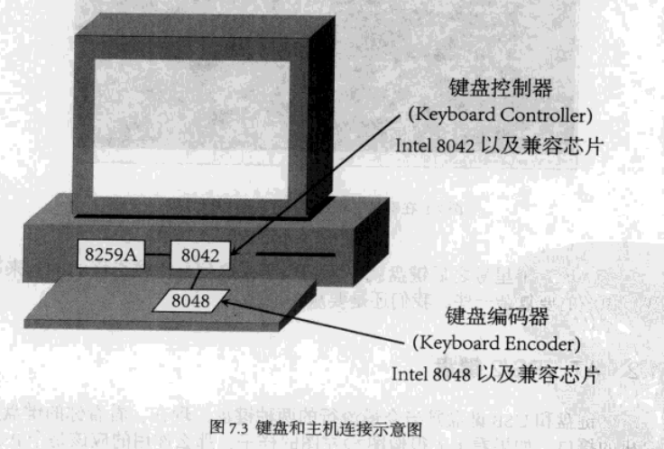
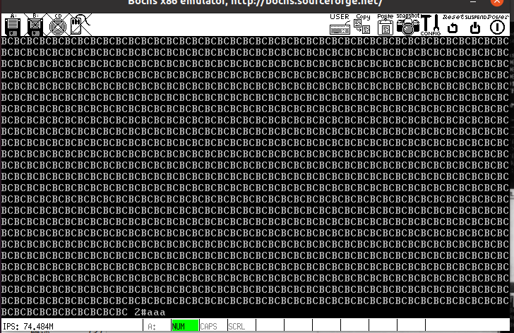

# ch7

## 目录

-   [键盘](#键盘)
    -   [初体验](#初体验)
    -   [AT、PS/2键盘](#ATPS2键盘)
    -   [键盘敲击过程](#键盘敲击过程)
    -   [用数组表示扫描码](#用数组表示扫描码)
    -   [键盘输入缓冲区](#键盘输入缓冲区)
    -   [用新加的任务处理键盘操作](#用新加的任务处理键盘操作)
    -   [解析操作码](#解析操作码)
-   [显示器](#显示器)
    -   [基本概念](#基本概念)
    -   [VGA](#VGA)
    -   [TTY任务](#TTY任务)
    -   [多控制台](#多控制台)
    -   [特殊按键](#特殊按键)
-   [区分任务以及用户进程](#区分任务以及用户进程)
-   [printf](#printf)
    -   [为进程指定TTY](#为进程指定TTY)

### 键盘

#### 初体验

首先实现一个很简单中断处理程序：

```c
PUBLIC void keyboard_handler(int irq)
{
  disp_str("*");
}

```

接下来打开键盘中断：

```c
PUBLIC void init_keyboard()
{
        put_irq_handler(KEYBOARD_IRQ, keyboard_handler);/*设定键盘中断处理程序*/
        enable_irq(KEYBOARD_IRQ);                       /*开键盘中断*/
}

```

运行结果如下图所示：


#### AT、PS/2键盘

PS/2键盘在AT上做了一点扩展。

AT键盘和PS/2键盘接口分别叫做"5-pin DIN"和"6-pin Mini-DIN"，如图所示：


#### 键盘敲击过程

-   键盘编码器芯片  —  监视键盘输入，并把适当数据传送给计算机。
-   键盘控制器   —  用来接收和解码来自键盘的数据，并与8259A以及软件进行通信

如下图所示：



两个含义：

-   动作 — 按下、保持按住、放开
-   内容 — 键的内容

敲击键盘产生的编码称作扫描码(Scan Code)，分为Make Code 和Break Code两类，按下或保持按住时，会产生Make Code，弹起时产生Break Code。除了Pause键之外，每个键都对应一个Make Code和一个Break Code。

现在键盘默认使用Scan code set 2。

8048检测到一个键的动作时，把相应的扫描码发送给8042，8042将其转化为相应的Scan code set 1扫描码，并将其放在输入缓冲区中，然后8042告诉8259A产生中断(IRQ1)。若此时有新的按键，8042将不再接收，一直到缓冲区清空，8042才能收到更多的扫描码。

所以上图中只打印一个字符，因为未将缓冲区中扫描码读出。

8042寄存器如下：


其中出和入是相对于系统而言(8042从8048输入数据然后输出到系统)。

修改中断处理程序如下：

```c
PUBLIC void keyboard_handler(int irq)
{
  /* disp_str("*"); */
  u8 scan_code = in_byte(0x60);
  disp_int(scan_code);
}
```

结果如下：


一次按键产生两个码(Make Code和Break Code)，因此一次按键产生两次中断。

扫描码如下表所示：


#### 用数组表示扫描码

Break Code 是Make Code与0x80进行或操作。

建立一个数组，扫描码为下标，对应元素就是相应字符。每三个值一组，分别是单独按某键，Shift+某键和0xE0前缀的扫描码对应的字符。

#### 键盘输入缓冲区

按下组合键时，需要进行识别，但8042缓冲区只有一个字符，需要自己建立一个缓冲区，用以放置收到的扫描码。

缓冲区结构体如下:

```c
/* Keyboard structure, 1 per console. */
typedef struct s_kb {
  char*  p_head;      /* 指向缓冲区中下一个空闲位置 */
  char*  p_tail;      /* 指向键盘任务应处理的字节 */
  int  count;      /* 缓冲区中共有多少字节 */
  char  buf[KB_IN_BYTES];  /* 缓冲区 */
}KB_INPUT;

```

如下图所示：


修改中断处理程序：

```c
PUBLIC void keyboard_handler(int irq)
{
  u8 scan_code = in_byte(KB_DATA);

  if (kb_in.count < KB_IN_BYTES) {
    *(kb_in.p_head) = scan_code;
    kb_in.p_head++;
    if (kb_in.p_head == kb_in.buf + KB_IN_BYTES) {
      kb_in.p_head = kb_in.buf;
    }
    kb_in.count++;
  }
}

```

#### 用新加的任务处理键盘操作

添加一个处理屏幕输出等内容的进程(即终端进程)。

如下所示：

```c
PUBLIC void task_tty()
{
  while (1) {
    keyboard_read();
  }
}
```

其中keyboard\_read()函数如下：

```c
PUBLIC void keyboard_read()
{
  u8 scan_code;

  if(kb_in.count > 0){
    disable_int();
    scan_code = *(kb_in.p_tail);
    kb_in.p_tail++;
    if (kb_in.p_tail == kb_in.buf + KB_IN_BYTES) {
      kb_in.p_tail = kb_in.buf;
    }
    kb_in.count--;
    enable_int();

    disp_int(scan_code);
  }
}
```

其中enable\_int()和diable\_int()如下：

```nasm
; ========================================================================
;       void disable_int();
; ========================================================================
disable_int:
  cli
  ret

; ========================================================================
;       void enable_int();
; ========================================================================
enable_int:
  sti
  ret

```

要关开中断是因为这个缓冲区是一个整体，对其中成员操作应该一气呵成。

#### 解析操作码

先把简单的打印出来，其他不做处理，且只有make code输出对应字符，结果如下（只能正常显示小写字母和数字）：


接下来处理shift，alt和ctrl。

运行结果如下(能输出大写字母)：


接下来再处理所有按键，有两种情况比较复杂，操作码超过三个字符或者F1，F2等。

解决完第一个问题后如下所示(没什么区别)：


解决完第二个问题后结果如下图所示(代码中&0xff是因为可打印字符的ASCII码为8位，也因为这个原因，FLAG\_EXT为0x0100)：


读出一个扫描码 scan\_code 后就要解析各种可能的情况：

1.  是 0xE1 类型的：判断是否为pausebreak(操作码有超过2个字节)
2.  是 0xE0 类型的：判断是否为printscreen(操作码有超过2个字节)，若不是，置code\_with\_E0为1。
3.  其他普通情况

    先判断是 make code 还是 break code，make打印，break不打印

    再获取扫描码在数组中的行数

    再根据此扫描码之前的按键是否为 shit以及code\_with\_E0的情况，判断所在列数

    再根据行数和列数得到key。
4.  最后调用 in\_process( key )上层处理函数来处理。（需要区分 ctrl,shit,alt以及不可打印字符）

### 显示器

在某个终端中，输入tty为终端号


不同的tty：


不同的tty对应一个键盘，输出好像在不同的显示器上，但实际上是一个显示器，只是显存的位置不同。

#### 基本概念

80×25文本模式

显存大小为32KB，范围为0xB8000\~0xBFFFF。

每2字节代表一个字符，如下图所示，低字节表示字符的ASCII码，高字符表示字符的属性，25行，每行80个字符。


若背景最高位为1，显示出的字符是闪烁的。

更多细节如下：


一个屏幕映射到显存中占用80×25×2=4000字节(4KB)，显存有32KB，所以现存中可以放8个屏幕的数据。

我们有3个TTY，分别使用10KB还有剩余，且可以实现滚屏功能。

#### VGA

VGA寄存器分为6组，如下所示：


数据寄存器有多个(Data Registers)，但只有一个0x3D5端口，此时需要用到Address Register。

下面是Data Registers对应的索引：


要访问其中一个时，先向Address Register写对应索引值，再通过0x3D5端口进行操作即可。

例如，控制光标如下:

```c
disable_int();
out_byte(CRTC_ADDR_REG, CURSOR_H);
out_byte(CRTC_DATA_REG, ((disp_pos/2)>>8)&0xFF);
out_byte(CRTC_ADDR_REG, CURSOR_L);
out_byte(CRTC_DATA_REG, (disp_pos/2)&0xFF);
enable_int();
```

运行结果如下图所示：


接下来重新设置开始显示地址()：

```c
if ((key & FLAG_SHIFT_L) || (key & FLAG_SHIFT_R)) {
                                disable_int();
                                out_byte(CRTC_ADDR_REG, START_ADDR_H);
                                out_byte(CRTC_DATA_REG, ((80*15) >> 8) & 0xFF);
                                out_byte(CRTC_ADDR_REG, START_ADDR_L);
                                out_byte(CRTC_DATA_REG, (80*15) & 0xFF);
                                enable_int();
}
                      
```

即若按住shift+⬆则向上滚屏15行，如下图所示：


#### TTY任务

在TTY任务中执行一个循环，轮询每个TTY，处理事务包括从缓冲区读取数据、显示字符等内容。如下图所示：


即每个TTY有两个任务，处理输入和处理输出。

之前的TTY如下图所示：


应作出下面的改变：

-   每一个TTY有自己的读写动作，在keyboard\_read()函数内部，需要了解自己是被哪一个TTY调用，要为函数传入一个当前TTY的指针参数。
-   让输入和输出分离，in\_process()不应直接回显字符，交给TTY来完成，为每一个TTY建立一个缓冲区，放置字符。
-   每个TTY回显字符时操作的CONSOLE不同，应有一个成员记载对应的CONSOLE信息。

TTY结构和CONSOLE结构如下所示：

```c
#ifndef _ORANGES_TTY_H_
#define _ORANGES_TTY_H_


#define TTY_IN_BYTES  256  /* tty input queue size */

struct s_console;

/* TTY */
typedef struct s_tty
{
  u32  in_buf[TTY_IN_BYTES];  /* TTY 输入缓冲区 */
  u32*  p_inbuf_head;    /* 指向缓冲区中下一个空闲位置 */
  u32*  p_inbuf_tail;    /* 指向键盘任务应处理的键值 */
  int  inbuf_count;    /* 缓冲区中已经填充了多少 */

  struct s_console *  p_console;
}TTY;


#endif /* _ORANGES_TTY_H_ */


#ifndef _ORANGES_CONSOLE_H_
#define _ORANGES_CONSOLE_H_


/* CONSOLE */
typedef struct s_console
{
  unsigned int  current_start_addr;  /* 当前显示到了什么位置    */
  unsigned int  original_addr;    /* 当前控制台对应显存位置 */
  unsigned int  v_mem_limit;    /* 当前控制台占的显存大小 */
  unsigned int  cursor;      /* 当前光标位置 */
}CONSOLE;


#define DEFAULT_CHAR_COLOR  0x07  /* 0000 0111 黑底白字 */


#endif /* _ORANGES_CONSOLE_H_ */

```

tty工作流程如下图所示：


在task\_tty()中，通过循环来处理每一个TTY的读和写操作，读操作会调用keyboard\_read（）函数，写操作会调用out\_char（）函数，将字符写入指定的CONSOLE。

由于32KB显存允许同时存在3个TTY以及对应的3个CONSOLE，因此定义三个TTY和CONSOLE。

首先对每个tty进行初始化，指定其CONSOLE以及初始化count，tail，head等。

同时，用nr\_current\_console记录当前的控制台是哪一个，只有当某个TTY对应的控制台是当前控制台时，它才可以读取键盘缓冲区：

```c
PRIVATE void tty_do_read(TTY* p_tty)
{
  if (is_current_console(p_tty->p_console)) {
    keyboard_read(p_tty);
  }
}
```

需要注意的是，此时keyboard\_read以及in\_process函数都要增加p\_tty参数，以便读到正确的缓冲区。

综上，流程如下：

1.  所有TTY被初始化
2.  nr\_current\_console被设为0
3.  对每一个TTY轮询，若为当前控制台，则首先执行tty\_do\_read()，然后执行tty\_do\_write。

运行结果如下图所示(此时只有一个TTY)：


#### 多控制台

多控制台如下图所示：


其中，original\_addr和v\_mem\_limit定义控制台所占显存的总体情况，初始化后不再改变。current\_start\_addr随着屏幕卷动而改变，cursor每输出一个字符更新一次。

首先要初始化每个CONSOLE，第一个控制台光标沿用原来的光标位置，其他的在左上角，并输出控制台号和'#'。运行结果如下图所示：


即响应shift+⬆以及shift+⬇，in\_process()检测到两个同时按下后，将对应的CONSOLE起始地址减一行或加一行即可。运行结果如下图所示：


接下来处理回车键以及退格键：


#### 特殊按键

Caps Lock、Num Lock、Scroll Lock

这三个键每个都对应一个小灯

使用端口0x60向8048发送命令，设置LED灯的命令是0xED，键盘收到后会回复一个ACK(0xFA)，然后等待从端口0x60写入的LED参数字节，参数定义如下:


键盘收到参数字节时，会再回复一个ACK，并设置LED，注意向8042输入缓冲区写数据时要先判断一下缓冲区是否为空，通过端口0x64读取状态寄存器，第1位如果为0表示输入缓冲区是空的。

如下图所示：

可以发现，灯亮了起来。


### 区分任务以及用户进程

让TTY留在ring1，ABC放在ring3.

### printf

#### 为进程指定TTY

在PCB中增加一个nr\_tty

A输出到0，B，C输出到1

增加一个系统调用write()：


结果如下所示：



